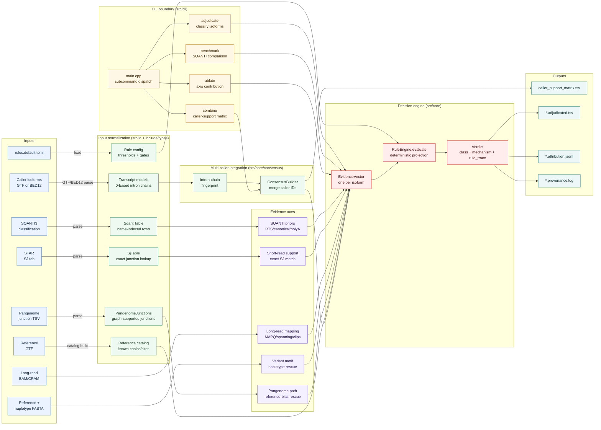

# PanIsoGuard

**Caller-agnostic adjudication of long-read RNA-seq novel isoforms.**

[](https://github.com/jibeomko/PanIsoGuard/actions/workflows/ci.yml)
[](LICENSE)

PanIsoGuard is a post-processing / decision layer that ingests the *novel* isoform
calls produced by long-read isoform callers (FLAIR, IsoQuant, Bambu, ESPRESSO,
TALON, …) and/or [SQANTI3](https://github.com/ConesaLab/SQANTI3) output, together
with a BAM and **optional** evidence inputs (short-read `SJ.tab`, personalized
haplotype FASTA), and re-classifies each novel call into a confidence class with a
**machine-readable mechanistic attribution** and a **provenance / circularity flag**.

It does not recompute SQANTI3's QC features and does not claim to beat the SQANTI3
random-forest filter or FLAIR2. Its contribution is the **adjudication logic** —
how orthogonal evidence axes are integrated into a transparent, auditable verdict
(thresholds live in a runtime [`config/rules.default.toml`](config/rules.default.toml),
and each verdict carries a `rule_trace`; see [docs/decision_engine.md](docs/decision_engine.md)).

## At a glance


<sub>Consumes caller + SQANTI3 output (does not replace them); adds an orthogonal,
auditable verdict layer, each call carrying a machine-readable `rule_trace`. The four
output classes shown are a simplified grouping — the full set is listed
[below](#confidence-classes). Vector source:
[`docs/figures/overview.svg`](docs/figures/overview.svg).</sub>

> **Status: alpha.** Four evidence axes (SQANTI priors, short-read junctions, BAM
> read-level mapping, variant/reference-bias) plus an **experimental** file-based
> pangenome reference-bias tier, and the `adjudicate` / `benchmark` / `ablate` /
> `combine` subcommands, are implemented and tested. Rule thresholds are
> conservative defaults that are **not yet calibrated** against simulated truth
> (SQANTI-SIM), and the pangenome tier is **not yet validated on real graph data**
> (see GATE-1 in [docs/decision_engine.md](docs/decision_engine.md)); treat the
> confidence classes as orthogonal evidence integration, not a calibrated probability.

## Subcommands

| Command | Purpose |
|---------|---------|
| `adjudicate` | classify novel isoforms → confidence class + mechanistic attribution + provenance (3 output files) |
| `benchmark`  | non-redundancy vs SQANTI3 on novel isoforms (2×2, Jaccard, McNemar) |
| `ablate`     | per-evidence-axis class-change (which axis drives which calls) |
| `combine`    | integrate multiple callers' isoforms by intron-chain fingerprint → caller-support matrix |
| `version`    | version, linked htslib, compiled-in capabilities |

`panisoguard <command> --help` for options. Input formats: [docs/input_formats.md](docs/input_formats.md).

## Usage

`adjudicate` is the main entry point. The **only** hard requirements are a SQANTI3
classification and an output prefix — every evidence input below is optional and
simply switches on another axis (see [Evidence tiers](#evidence-tiers)). PanIsoGuard
is caller- and organism-agnostic; the paths below are placeholders for your own
caller output, reference, and reads (any long-read caller, any genome build).

**Baseline** — SQANTI priors only (no short/long-read evidence; novel calls are
flagged or held, never positively confirmed):

```bash
panisoguard adjudicate \
  --classification classification.txt \
  --isoforms-bed   isoforms.bed \
  --ref-gtf        annotation.gtf \
  --out-prefix     out/sample
```

**Recommended** — add short-read junctions (`--sj-tab`) and the long-read BAM
(`--bam`), the two axes that let a novel isoform be confirmed or rejected on evidence:

```bash
panisoguard adjudicate \
  --classification classification.txt \
  --isoforms-bed   isoforms.bed \
  --ref-gtf        annotation.gtf \
  --sj-tab         SJ.out.tab \
  --bam            aligned.bam \
  --reference      genome.fa \
  --out-prefix     out/sample
```

**Reference-bias rescue** — add a personalized haplotype FASTA. Provenance gates the
circularity firewall: `wgs`/`external` may promote to a rescue verdict, while
`rna_derived`/`unknown` are held as `AMBIGUOUS`:

```bash
panisoguard adjudicate \
  --classification classification.txt \
  --isoforms-bed   isoforms.bed \
  --ref-gtf        annotation.gtf \
  --reference      genome.fa \
  --reference-haplotype haplotype1.fa \
  --reference-haplotype haplotype2.fa \
  --haplotype-provenance wgs \
  --out-prefix     out/sample
```

**Pangenome reference-bias rescue** (experimental) — supply graph-supported splice
junctions (pre-extracted from a pangenome graph such as HPRC with vg/rpvg). An isoform
whose novel junctions are **all** realizable on a graph haplotype path is rescued as
reference bias. This is independent evidence only if the junction set comes from
population assemblies, so it is gated by `--pangenome-provenance` (the same circularity
firewall as the variant axis): `population`/`external` promote, while the default
`unknown` (or `sample_derived`) is held `AMBIGUOUS`:

```bash
panisoguard adjudicate \
  --classification classification.txt \
  --isoforms-bed   isoforms.bed \
  --ref-gtf        annotation.gtf \
  --pangenome-junctions pangenome_junctions.tsv \
  --pangenome-provenance population \
  --out-prefix     out/sample
```

**Combine several callers first** (optional) — merge isoforms by intron-chain
fingerprint into a caller-support matrix, then feed the union to `adjudicate`:

```bash
panisoguard combine \
  --gtf flair:flair.gtf \
  --gtf isoquant:isoquant.gtf \
  --gtf bambu:bambu.gtf \
  --ref-gtf annotation.gtf \
  --out caller_support_matrix.tsv
```

### Outputs

`adjudicate` writes three files at `<out-prefix>`:

| File | Contents |
|------|----------|
| `<prefix>.adjudicated.tsv`   | one row per isoform — confidence class, primary mechanism, novel-junction support counts |
| `<prefix>.attribution.jsonl` | per-isoform `rule_trace`: every rule that fired, in order (fully auditable) |
| `<prefix>.provenance.log`    | which axes were active + circularity status of the run |

### Benchmarking & ablation

```bash
# non-redundancy vs the SQANTI3 filter on novel isoforms (2x2, Jaccard, McNemar)
panisoguard benchmark [adjudicate options] --out bench/

# per-axis contribution: which calls change when an axis is removed
panisoguard ablate    [adjudicate options] --axes short_read,mapping,variant --out abl/
```

## Confidence classes

`HIGH_CONF_KNOWN` · `HIGH_CONF_NOVEL` · `MEDIUM_CONF_NOVEL` · `LOW_CONF_PARTIAL` ·
`PAN_REF_RESCUED_FALSE_NOVEL` · `AMBIGUOUS` · `ARTIFACT` — emitted as a
deterministic projection of a 2-axis evidence grid (novelty-support ×
artifact-mechanism). `PAN_REF_RESCUED_FALSE_NOVEL` is reached when a novel junction
is explained by reference bias — either a personalized haplotype (variant axis,
`--reference-haplotype`) or a pangenome graph path (pangenome axis,
`--pangenome-junctions`).

## Evidence tiers

| Tier | Input | Required? | Mechanism |
|------|-------|-----------|-----------|
| 0 | SQANTI3 classification (priors) + STAR `SJ.tab` | recommended | short-read junction corroboration |
| 1 | BAM (HiFi/ONT) | recommended | read-level mapping / chimera / soft-clip features |
| 2 | personalized haplotype FASTA (`--reference-haplotype`) | optional | variant-created/destroyed splice-site motif |
| 3 | pangenome graph junctions (`--pangenome-junctions`) | optional, **experimental** | all novel junctions realizable on a graph haplotype path → reference bias (provenance-gated) |

## Documentation

| Doc | Contents |
|-----|----------|
| [docs/architecture.md](docs/architecture.md) | The five layers (CLI → readers → core data model → evidence → decision) and data flow. |
| [docs/algorithm.md](docs/algorithm.md) | The per-isoform adjudication algorithm and the decision projection. |
| [docs/function_io.md](docs/function_io.md) | Module-by-module input → output contracts and key data types. |
| [docs/decision_engine.md](docs/decision_engine.md) | The 2-axis grid, rescue precedence, and the circularity firewall. |
| [docs/input_formats.md](docs/input_formats.md) | Every input file format and its options. |
| [docs/validation.md](docs/validation.md) | What is verified and the truth-based validation plan. |

## Repository layout

```text
PanIsoGuard/
|-- README.md                       # quick-start, repository map, and architecture map
|-- CMakeLists.txt                  # C++17/CMake build, install target, test wiring
|-- cmake/FindHTSlib.cmake          # htslib discovery for source and conda builds
|-- config/rules.default.toml        # default thresholds and rule gates
|-- include/panisoguard/             # typed module interfaces
|   |-- types.hpp                    # Junction, IntronChain, Transcript, Evidence primitives
|   |-- adjudicator.hpp              # per-isoform evidence collection and decision API
|   |-- rules.hpp, verdict.hpp       # rule configuration, classes, mechanisms, rule traces
|   |-- consensus.hpp, fingerprint.hpp, interval_index.hpp
|   |-- gtf.hpp, bed12.hpp, sqanti.hpp, sj_tab.hpp, pangenome.hpp
|   `-- bam_features.hpp, variant_motif.hpp, result_writer.hpp
|-- src/
|   |-- cli/                         # subcommands: adjudicate, combine, benchmark, ablate
|   |-- io/                          # SQANTI/GTF/BED12/SJ/pangenome readers + result writer
|   |-- evidence/                    # htslib-backed BAM and FASTA/faidx evidence axes
|   `-- core/                        # consensus, catalog, rule engine, verdict projection
|-- tests/
|   |-- unit/                        # Catch2 tests, module by module
|   `-- data/tiny/                   # minimal BAM/GTF/BED/SQANTI/SJ/FASTA fixtures
|-- docs/                            # architecture, algorithm, input contracts, validation plan
|-- docs/figures/                    # overview figure source and rendered README image
|-- workflow/                        # optional Snakemake orchestration around PanIsoGuard
|-- benchmark/                       # synthetic axes, truth sets, SIRV, HG002, calibration notes
|-- recipes/bioconda/                # Bioconda meta.yaml and build.sh
|-- thirdparty/                      # vendored single-header components and licenses
|-- LICENSE
`-- THIRDPARTY.txt
```

## Architecture map



## Build

Requires a C++17 compiler, CMake ≥ 3.20, and **htslib ≥ 1.18**.

```bash
git clone <repo> && cd PanIsoGuard
cmake -S . -B build -DCMAKE_BUILD_TYPE=Release
cmake --build build -j
ctest --test-dir build            # unit suite
./build/panisoguard --version
```

htslib is discovered from `$CONDA_PREFIX`; override with `-DCMAKE_PREFIX_PATH=/prefix`.

## Install (conda)

A bioconda recipe is provided under [`recipes/bioconda/`](recipes/bioconda/). Once
released:

```bash
conda install -c bioconda -c conda-forge panisoguard
```

## Runtime & memory

Single-threaded, on one cohort's merged set (188,912 isoforms; GRCh38 + GENCODE v49):

| Step | Wall | Peak RAM |
|------|------|----------|
| reference catalog (GENCODE v49) | ~3.2 s | ~0.34 GB |
| `adjudicate` (SQANTI priors + short-read SJ) | ~5 s | ~0.55 GB |
| + variant axis (faidx motif) | ~40 s | ~0.6 GB |
| + BAM mapping axis (4.5 GB BAM) | ~1.6 min | ~0.6 GB |

The upstream callers + alignment dominate end-to-end time; PanIsoGuard's own
adjudication is the fast tail.

## Orchestration (optional)

[`workflow/`](workflow/) provides a Snakemake pipeline that runs the upstream
callers in parallel over a single shared alignment and pipes into PanIsoGuard
(`combine` + `adjudicate`). It is a thin convenience wrapper, not the core tool.

## Validation

See [docs/validation.md](docs/validation.md) for what is verified and the
truth-based validation plan (SQANTI-SIM, HG002/HPRC, LRGASP).

## License

PanIsoGuard is MIT-licensed — see [LICENSE](LICENSE).

It bundles three third-party single-header components under `thirdparty/`, with
their license texts included: **cgranges** (`IITree.h`, MIT), **toml++** (MIT), and
**Catch2** (Boost Software License 1.0, test-only). See [THIRDPARTY.txt](THIRDPARTY.txt)
for attribution. The effective combined license of the redistributed source is
**MIT AND BSL-1.0**. htslib is a dynamically-linked dependency, not vendored.
