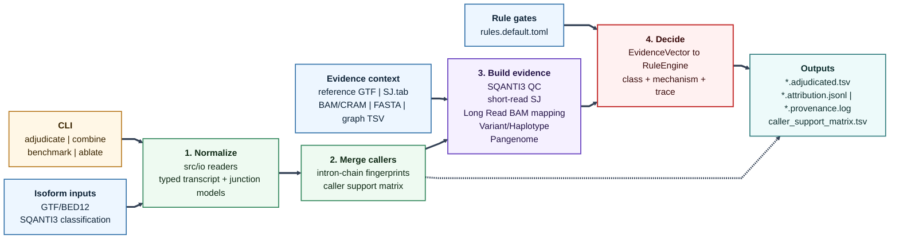

# PanIsoGuard

**Caller-agnostic adjudication of long-read RNA-seq novel isoforms.**

[](https://github.com/jibeomko/PanIsoGuard/actions/workflows/ci.yml)
[](LICENSE)

PanIsoGuard is a post-processing / decision layer that ingests the *novel* isoform
calls produced by long-read isoform callers (FLAIR, IsoQuant, Bambu, ESPRESSO,
TALON, …) and/or [SQANTI3](https://github.com/ConesaLab/SQANTI3) output, together
with a BAM and **optional** evidence inputs (short-read `SJ.tab`, personalized
haplotype FASTA), and re-classifies each novel call into a confidence class with a
**machine-readable mechanistic attribution** and a **provenance / circularity flag**.

> **Status: alpha.** Four evidence axes (SQANTI priors, short-read junctions, BAM
> read-level mapping, variant/reference-bias) plus a file-based pangenome
> reference-bias tier are implemented and tested, along with the
> `adjudicate` / `benchmark` / `ablate` / `combine` subcommands.
>
> **What it is — and is not.** PanIsoGuard is a tool for **traceable verdicts**: every
> novel call gets a class, the mechanism behind it, and the exact rules that fired. It is
> **not a more accurate filter.** In a head-to-head on SQANTI-SIM truth it ties a
> one-line short-read rule ("keep an isoform if every junction has ≥ 3 short reads") on
> ranking. At its default operating point it gives up recall for precision. With no short
> reads it is worse than the SQANTI3 rules filter. See
> [How it compares](#how-it-compares).

## Contents

- [Quick start](#quick-start) · [Install](#install) · [Usage](#usage) · [Outputs](#outputs) · [Confidence classes](#confidence-classes) · [Evidence tiers](#evidence-tiers)
- [When to use PanIsoGuard](#when-to-use-panisoguard) · [How it compares](#how-it-compares) · [Scope and design](#scope-and-design) · [Validation](#validation)
- [Runtime & memory](#runtime--memory) · [Documentation](#documentation) · [Repository layout](#repository-layout) · [Architecture map](#architecture-map)

## At a glance

![How PanIsoGuard judges a novel isoform, in five steps, followed for one example isoform, iso_B. 1, read inputs: the SQANTI3 classification, the caller's isoforms and the reference annotation are needed; short-read junctions (SJ.tab), a long-read BAM, genome haplotypes and a caller-support matrix are optional. 2, find novel junctions: iso_B has one junction that is not in the reference. 3, gather evidence: short reads support it; long reads and SQANTI3 QC find no artifact signal; callers and genome were not given, so they are not evaluated. 4, apply fixed rules: reference bias is checked first (not evaluated here); then short-read support times artifact signal gives the class, and iso_B lands on supported with no artifact signal. 5, report the verdict: confirmed novel (the other outcomes are reference bias, unconfirmed and artifact), written to a verdict table, the reasons and a run log.](docs/figures/overview.png)

<sub>iso_B is one isoform of the toy gene in the [study notes](notes/README.md); its marks are real
output of the notes' main run (short reads and a long-read BAM, no genome or caller input). In
step 4, rows are short-read support and columns the artifact signal: none, long-read mapping,
SQANTI3 QC. The four verdict groups cover the six novel-isoform classes
([full list](#confidence-classes)). Vector source:
[`docs/figures/overview.svg`](docs/figures/overview.svg).</sub>

## Quick start

Paste this into a Linux (or macOS) terminal. It needs only `git` and `conda` (Miniconda,
Miniforge or Mamba; `mamba` works the same) and builds PanIsoGuard in its own conda
environment, so no system compiler or htslib is involved. The first run downloads the
compilers and htslib (a few minutes); the examples then run offline in under a second.

```bash
git clone https://github.com/jibeomko/PanIsoGuard.git
cd PanIsoGuard
conda create -y -n panisoguard --override-channels -c conda-forge -c bioconda \
    cxx-compiler c-compiler cmake make zlib "htslib>=1.18"
conda activate panisoguard

cmake -S . -B build -DCMAKE_BUILD_TYPE=Release
cmake --build build -j

examples/tiny/run.sh            # one caller: a known, a short-read-supported novel, and an artifact isoform
examples/multi_caller/run.sh    # three callers: combine -> consensus verdict
```

Each example prints its verdicts and ends with `example output matches expected files` /
`output matches expected` (checked against the committed `expected/` files).
`--override-channels` takes the packages only from conda-forge and bioconda, whatever channels
your conda is set up with. The tool is now `build/panisoguard` (it runs without the environment
active); `export PATH="$PWD/build:$PATH"` lets you call it as `panisoguard`, as in
[Usage](#usage).

**No conda? Docker** (in the same `PanIsoGuard` folder):

```bash
docker build -t panisoguard .
docker run --rm -u "$(id -u):$(id -g)" -v "$PWD":/work -w /work panisoguard examples/tiny/run.sh
docker run --rm -u "$(id -u):$(id -g)" -v "$PWD":/work -w /work panisoguard examples/multi_caller/run.sh
```

`-u` runs the container as you, so it can write into your folder. The image also contains the
optional PDF report tool; outside it, `pip install ./python` and then
`panisoguard-report --prefix <out-prefix>` (see [python/](python/)).

For a step-by-step walk-through of how one toy gene's inputs become verdicts, see the
study notes (in Korean): [notes/](notes/README.md).

## Install

### Bioconda

A bioconda recipe is provided under [`recipes/bioconda/`](recipes/bioconda/) and has been
submitted ([bioconda-recipes #65953](https://github.com/bioconda/bioconda-recipes/pull/65953),
awaiting review). Once it is merged:

```bash
conda install -c conda-forge -c bioconda panisoguard
```

### Container

`docker build -t panisoguard .` (see [Quick start](#quick-start)), then put `panisoguard` in
front of any command and mount your data:

```bash
docker run --rm -u "$(id -u):$(id -g)" -v "$PWD":/data -w /data panisoguard \
    panisoguard adjudicate --classification cls.txt --isoforms-gtf iso.gtf --ref-gtf ref.gtf --out-prefix run
docker run --rm -u "$(id -u):$(id -g)" -v "$PWD":/data -w /data panisoguard \
    panisoguard-report --prefix run
```

### From source

The [Quick start](#quick-start) builds from source in a conda environment. With your own
toolchain you need a C++17 compiler, CMake ≥ 3.20 and **htslib ≥ 1.18** (older distribution
packages are too old; the conda route avoids this). htslib is found in `$CONDA_PREFIX`, or pass
`-DCMAKE_PREFIX_PATH=/prefix`.

```bash
cmake -S . -B build -DCMAKE_BUILD_TYPE=Release
cmake --build build -j
ctest --test-dir build            # unit, integration and example tests
./build/panisoguard --version
```

## Usage

`adjudicate` is the main entry point. It needs the SQANTI3 classification, the caller's
isoforms (`--isoforms-gtf` or `--isoforms-bed`, with the same isoform ids as the
classification), and an output prefix. In practice also give `--ref-gtf` (the annotation
you gave SQANTI3): without it no junction can be called novel and every novel isoform is
held `AMBIGUOUS`. Every other input is optional and switches on one more evidence axis
(see [Evidence tiers](#evidence-tiers)). PanIsoGuard is caller- and organism-agnostic;
the paths below are placeholders for your own caller output, reference, and reads.

**Baseline** — SQANTI priors only (no short/long-read evidence; novel calls are
flagged or held, never positively confirmed):

```bash
panisoguard adjudicate \
  --classification classification.txt \
  --isoforms-bed   isoforms.bed \
  --ref-gtf        annotation.gtf \
  --out-prefix     out/sample
```

**Recommended** — add short-read junctions (`--sj-tab`) and the long-read BAM
(`--bam`), the two axes that let a novel isoform be confirmed or rejected on evidence:

```bash
panisoguard adjudicate \
  --classification classification.txt \
  --isoforms-bed   isoforms.bed \
  --ref-gtf        annotation.gtf \
  --sj-tab         SJ.out.tab \
  --bam            aligned.bam \
  --reference      genome.fa \
  --out-prefix     out/sample
```

**Reference-bias rescue** — add a personalized haplotype FASTA. Provenance gates the
circularity firewall: `wgs`/`external` may promote to a rescue verdict, while
`rna_derived`/`unknown` are held as `AMBIGUOUS`:

```bash
panisoguard adjudicate \
  --classification classification.txt \
  --isoforms-bed   isoforms.bed \
  --ref-gtf        annotation.gtf \
  --reference      genome.fa \
  --reference-haplotype haplotype1.fa \
  --reference-haplotype haplotype2.fa \
  --haplotype-provenance wgs \
  --out-prefix     out/sample
```

**Pangenome reference-bias rescue** (file-based; validated on HPRC v1.1 chr22) — supply graph-supported splice
junctions (pre-extracted from a pangenome graph such as HPRC with vg/rpvg). An isoform
whose novel junctions are **all** realizable on a graph haplotype path is rescued as
reference bias. This is independent evidence only if the junction set comes from
population assemblies, so it is gated by `--pangenome-provenance` (the same circularity
firewall as the variant axis): `population`/`external` promote, while the default
`unknown` (or `sample_derived`) is held `AMBIGUOUS`:

```bash
panisoguard adjudicate \
  --classification classification.txt \
  --isoforms-bed   isoforms.bed \
  --ref-gtf        annotation.gtf \
  --pangenome-junctions pangenome_junctions.tsv \
  --pangenome-provenance population \
  --out-prefix     out/sample
```

**Combine several callers first** (optional) — merge isoforms by intron-chain
fingerprint into a caller-support matrix, then feed the union to `adjudicate`:

```bash
panisoguard combine \
  --gtf flair:flair.gtf \
  --gtf isoquant:isoquant.gtf \
  --gtf bambu:bambu.gtf \
  --ref-gtf annotation.gtf \
  --out caller_support_matrix.tsv
```

> `combine` is a clean re-implementation of the established N-way intron-chain comparison
> (it reproduces `gffcompare -i` exactly; multi-caller consensus is shared practice, not a
> PanIsoGuard invention). Its value is feeding caller agreement into the adjudicator as one
> auditable evidence axis. PanIsoGuard's differentiator is the **reference-bias rescue +
> circularity firewall** — see
> [docs/relationship_to_merge_tools.md](docs/relationship_to_merge_tools.md).

### Outputs

`adjudicate` writes three files at `<out-prefix>`:

| File | Contents |
|------|----------|
| `<prefix>.adjudicated.tsv`   | one row per isoform — confidence class, primary mechanism, novel-junction support counts |
| `<prefix>.attribution.jsonl` | per-isoform `rule_trace` (the rules that fired, in order) + `graph_trace` (splice-graph view — see [docs/method_graph.md](docs/method_graph.md)) + `bio_flags` (SQANTI3 QC descriptors passed through, verdict-neutral — see [docs/relationship_to_sqanti3.md](docs/relationship_to_sqanti3.md)) |
| `<prefix>.provenance.log`    | tool and ruleset version, the effective thresholds, which axes were active, circularity status, class counts |

What the verdicts look like: four isoforms of the same toy gene, the evidence found for each,
and the verdict with its reason (real output of one run; the ringed evidence decided each
verdict).

![Verdict examples: a table of four novel isoforms of a toy gene. For each, the evidence PanIsoGuard checks (short reads, long-read alignment, SQANTI3 QC, the person's own genome) is marked as supports, partly, against or nothing found, followed by the verdict and its reason: iso_B confirmed novel (junction in 12 short reads), iso_C unconfirmed (1 of 2 junctions confirmed), iso_G artifact (no short reads and an indel beside the junction), iso_A reference bias (non-canonical only on the reference genome, canonical on the person's haplotype).](docs/figures/verdict_examples.png)

### Confidence classes

`HIGH_CONF_KNOWN` · `HIGH_CONF_NOVEL` · `MEDIUM_CONF_NOVEL` · `LOW_CONF_PARTIAL` ·
`PAN_REF_RESCUED_FALSE_NOVEL` · `AMBIGUOUS` · `ARTIFACT` — emitted as a
deterministic projection of a 2-axis evidence grid (novelty-support ×
artifact-mechanism). `PAN_REF_RESCUED_FALSE_NOVEL` is reached when a novel junction
is explained by reference bias — either a personalized haplotype (variant axis,
`--reference-haplotype`) or a pangenome graph path (pangenome axis,
`--pangenome-junctions`).

### Evidence tiers

| Tier | Input | Required? | Mechanism |
|------|-------|-----------|-----------|
| 0 | SQANTI3 classification (priors) + STAR `SJ.tab` | recommended | short-read junction corroboration |
| 1 | BAM (HiFi; ONT needs re-calibrated thresholds) | recommended | read-level mapping (low-MAPQ / supplementary / indel-near spanning-read fractions; soft-clip reported, gate off by default) |
| 2 | personalized haplotype FASTA (`--reference-haplotype`) | optional | variant-created splice-site motif (non-canonical on the reference, canonical on the haplotype) |
| 3 | pangenome graph junctions (`--pangenome-junctions`) | optional | all novel junctions realizable on a graph haplotype path → reference bias (provenance-gated; validated on HPRC v1.1 chr22) |

### Other subcommands

| Command | Purpose |
|---------|---------|
| `adjudicate` | classify novel isoforms → confidence class + mechanistic attribution + provenance (3 output files) |
| `benchmark`  | non-redundancy vs SQANTI3 on novel isoforms (2×2, Jaccard, McNemar) |
| `ablate`     | per-evidence-axis class-change (which axis drives which calls) |
| `combine`    | integrate multiple callers' isoforms by intron-chain fingerprint → caller-support matrix |
| `version`    | version, linked htslib, compiled-in capabilities |

`panisoguard <command> --help` for options. Input formats: [docs/input_formats.md](docs/input_formats.md).

#### Benchmarking & ablation

```bash
# non-redundancy vs the SQANTI3 filter on novel isoforms (2x2, Jaccard, McNemar)
panisoguard benchmark [adjudicate options] --out bench/

# per-axis contribution: which calls change when an axis is removed
panisoguard ablate    [adjudicate options] --axes short_read,mapping,variant --out abl/
```

## When to use PanIsoGuard

Use it when you have **novel** long-read isoform calls and need to see **why** each one is
trusted or not. If you only need a filtered GTF, the SQANTI3 rules filter (or requiring
short-read support on every junction) is as accurate and simpler — see
[How it compares](#how-it-compares).

- **You ran more than one isoform caller** (FLAIR / IsoQuant / Bambu / ESPRESSO / TALON, …)
  and have several *disagreeing* novel-isoform sets. PanIsoGuard integrates them
  caller-agnostically by splice chain and stratifies each novel call by cross-caller
  agreement — single-caller novels are mostly artifacts, multi-caller agreement is a strong,
  matcher-robust confidence signal ([benchmark/multicaller](benchmark/multicaller)).
- **You want a transparent confidence class per novel call**, not a flat GTF — each verdict
  is one of 7 classes with a machine-readable `rule_trace` (and an optional
  [PDF report](python/README.md)), so you can filter `HIGH`/`MEDIUM_CONF_NOVEL` and audit the
  rest instead of eyeballing reads.
- **You have a personalized haplotype or a pangenome** and want to flag *reference-bias*
  candidates — a junction that is non-canonical on the linear reference but canonical on
  the sample's haplotype. A circularity firewall blocks rescues that would rest on the
  sample's own RNA. Expect few hits (~30–45 per divergent genome). A phasing check on two
  divergent genomes supports the explanation for 27 of 28 testable heterozygous junctions:
  the reads that use the junction come from the haplotype on which it is canonical
  ([benchmark/refbias_phasing](benchmark/refbias_phasing)). Homozygous ones cannot be
  checked this way.

**It is *not* a caller or a QC re-implementation.** It sits *above* the callers and consumes
SQANTI3 QC as priors — it does not re-derive TSS/TTS, ORF/NMD, polyA, or splice motifs
([docs/relationship_to_sqanti3.md](docs/relationship_to_sqanti3.md)), and its `combine` step
is a clean re-implementation of `gffcompare -i`, not a new merge
([docs/relationship_to_merge_tools.md](docs/relationship_to_merge_tools.md)).

## How it compares

SQANTI-SIM truth (GENCODE v49 chr22, FLAIR + SQANTI3), 870 non-FSM isoforms (730 genuine /
140 false). All methods got the same inputs. "1M short reads" = 1M simulated Illumina pairs
→ STAR. Full tables, bootstrap CIs, and caveats are in
[benchmark/sqanti3_filter_h2h](benchmark/sqanti3_filter_h2h).

| short reads | method | precision | recall | F1 | AUPRC |
|---|---|---:|---:|---:|---:|
| none | SQANTI3 rules filter | 0.918 | 0.886 | **0.902** | **0.909** |
| none | PanIsoGuard (+ BAM) | — (0 calls) | 0.000 | — | 0.824 (0.875) |
| 1M | SQANTI3 rules filter | 0.918 | 0.890 | 0.904 | 0.909 |
| 1M | every junction ≥ 3 short reads | 0.976 | **0.945** | **0.960** | 0.968 |
| 1M | PanIsoGuard | **0.990** | 0.545 | 0.703 | 0.968 |
| 1M | PanIsoGuard + BAM | **0.990** | 0.545 | 0.703 | **0.977** |

- PanIsoGuard is the most precise. Its recall is low because it abstains on NIC isoforms
  (no individually-novel junction to corroborate) and ISM isoforms.
- On ranking (AUPRC) it ties the one-line short-read rule. The BAM mapping axis adds about
  +0.01; that gain is significant only at the lowest short-read depth.
- Without short reads it makes no positive calls unless you give it multi-caller support
  (`--caller-support`).

So use it for the per-call trace, not for a higher score.

## Scope and design

**PanIsoGuard does not recompute SQANTI3 QC descriptors.** It consumes them as priors
and integrates them with independent path-level evidence from caller consensus,
short-read junction support, long-read mapping, personalized haplotypes, and
pangenome-supported junctions — it does not re-derive TSS/TTS, ORF/NMD, polyA, or
splice motifs, and is not a SQANTI3-style QC filter (see
[docs/relationship_to_sqanti3.md](docs/relationship_to_sqanti3.md)). Its contribution is
the **adjudication logic** — how those orthogonal evidence axes are integrated into a
transparent, auditable verdict (thresholds live in a runtime
[`config/rules.default.toml`](config/rules.default.toml), and each verdict carries a
`rule_trace`; see [docs/decision_engine.md](docs/decision_engine.md)).

> PanIsoGuard is an **independent project**, not affiliated with or endorsed by the
> SQANTI3 authors. It interoperates with SQANTI3 by reading its output file only (no
> SQANTI3 code is bundled or linked; SQANTI3's GPL-3.0 does not reach PanIsoGuard's MIT
> code). If you use SQANTI3 in your pipeline, please cite it — see
> [docs/relationship_to_sqanti3.md](docs/relationship_to_sqanti3.md#attribution-licensing--citation).

Equivalently, each candidate isoform can be viewed as a **path through a gene-local
splice graph** — novel junctions are edges absent from the known (reference) graph —
and the same deterministic verdict can be read in those terms. This is a *framing*
of the existing engine (no graph model or new algorithm); each verdict additionally
carries a machine-readable `graph_trace` (novel-edge count, edge support, graph
distance). See [docs/method_graph.md](docs/method_graph.md).

## Validation

See [docs/validation.md](docs/validation.md) for what is verified and the
truth-based validation plan (SQANTI-SIM, HG002/HPRC, LRGASP).

**Thresholds.** A SQANTI-SIM (v49 chr22) threshold **sweep** finds AUPRC
**robust (0.970–0.971)** across the grid with the shipped default within 1e-4 of
grid-best ([benchmark/results/sqanti_sim/sweep.tsv](benchmark/results/sqanti_sim/sweep.tsv)),
though not yet swept on additional datasets.

**Pangenome.** The file-based pangenome reference-bias rescue is **validated on the
real HPRC v1.1 chr22 graph** (GATE-1): 0 false rescues on real FLAIR novel junctions,
correct rescue on real population deletions, firewall holding under circular-risk
provenance ([benchmark/pangenome](benchmark/pangenome)). Validated at chr22 scale; the
in-process GBZ traversal remains future work. Treat the confidence classes as
calibrated *ordinal* evidence integration, not a tuned probability.

## Runtime & memory

Single-threaded, on a whole-genome isoform set (GRCh38 + GENCODE v49):

| Step | Wall | Peak RAM |
|------|------|----------|
| reference catalog (GENCODE v49) | ~3 s | ~0.34 GB |
| `adjudicate` (SQANTI priors + short-read SJ) | ~5 s | ~0.55 GB |
| + variant axis (faidx motif) | ~40 s | ~0.6 GB |
| + BAM mapping axis | ~1.6 min | ~0.6 GB |

The upstream callers + alignment dominate end-to-end time; PanIsoGuard's own
adjudication is the fast tail.

## Orchestration (optional)

[`workflow/`](workflow/) provides a Snakemake pipeline that runs the upstream
callers in parallel over a single shared alignment and pipes into PanIsoGuard
(`combine` + `adjudicate`). It is a thin convenience wrapper, not the core tool.

## Documentation

| Doc | Contents |
|-----|----------|
| [docs/architecture.md](docs/architecture.md) | The five layers (CLI → readers → core data model → evidence → decision) and data flow. |
| [docs/algorithm.md](docs/algorithm.md) | The per-isoform adjudication algorithm and the decision projection. |
| [docs/function_io.md](docs/function_io.md) | Module-by-module input → output contracts and key data types. |
| [docs/decision_engine.md](docs/decision_engine.md) | The 2-axis grid, rescue precedence, and the circularity firewall. |
| [docs/method_graph.md](docs/method_graph.md) | The splice-graph framing: isoform = path, novel junction = edge, novelty = graph distance, and the `graph_trace`. |
| [docs/relationship_to_sqanti3.md](docs/relationship_to_sqanti3.md) | What PanIsoGuard consumes from SQANTI3 vs does not recompute; the `bio_flags` pass-through. |
| [docs/relationship_to_merge_tools.md](docs/relationship_to_merge_tools.md) | How `combine` relates to gffcompare / TAMA / Bambu-NDR, and where PanIsoGuard is actually differentiated. |
| [docs/input_formats.md](docs/input_formats.md) | Every input file format and its options. |
| [docs/validation.md](docs/validation.md) | What is verified and the truth-based validation plan. |
| [CHANGELOG.md](CHANGELOG.md) · [docs/releasing.md](docs/releasing.md) | Changelog, and the release / bioconda runbook. |
| [notes/](notes/README.md) | Study notes (in Korean): one toy gene followed from input files to verdict, one step per note. Every code block was run and its output is shown; `notes/check_notes.py` (CTest `integration_study_notes`) keeps them in sync with the binary. |

## Repository layout

```text
PanIsoGuard/
|-- README.md                       # quick-start, repository map, and architecture map
|-- CMakeLists.txt                  # C++17/CMake build, install target, test wiring
|-- cmake/FindHTSlib.cmake          # htslib discovery for source and conda builds
|-- config/rules.default.toml        # default thresholds and rule gates
|-- include/panisoguard/             # typed module interfaces
|   |-- types.hpp                    # Junction, IntronChain, Transcript, Evidence primitives
|   |-- adjudicator.hpp              # per-isoform evidence collection and decision API
|   |-- rules.hpp, verdict.hpp       # rule configuration, classes, mechanisms, rule traces
|   |-- consensus.hpp, fingerprint.hpp, interval_index.hpp
|   |-- gtf.hpp, bed12.hpp, sqanti.hpp, sj_tab.hpp, pangenome.hpp
|   `-- bam_features.hpp, variant_motif.hpp, result_writer.hpp
|-- src/
|   |-- cli/                         # subcommands: adjudicate, combine, benchmark, ablate
|   |-- io/                          # SQANTI/GTF/BED12/SJ/pangenome readers + result writer
|   |-- evidence/                    # htslib-backed BAM and FASTA/faidx evidence axes
|   `-- core/                        # consensus, catalog, rule engine, verdict projection
|-- tests/
|   |-- unit/                        # Catch2 tests, module by module
|   `-- data/tiny/                   # minimal BAM/GTF/BED/SQANTI/SJ/FASTA fixtures
|-- docs/                            # architecture, algorithm, input contracts, validation plan
|-- docs/figures/                    # README figures (SVG sources + rendered PNGs)
|-- notes/                           # study notes (Korean): a toy gene followed through every step
|-- workflow/                        # optional Snakemake orchestration around PanIsoGuard
|-- benchmark/                       # synthetic axes, truth sets, SIRV, HG002, calibration notes
|-- examples/tiny/                   # 5-minute dataset with expected adjudicate outputs
|-- recipes/bioconda/                # Bioconda meta.yaml and build.sh
|-- thirdparty/                      # vendored single-header components and licenses
|-- LICENSE
`-- THIRDPARTY.txt
```

## Architecture map


```mermaid
%%{init: {"theme": "base", "themeCSS": "svg { background: #ffffff; }", "themeVariables": {"background": "#ffffff", "mainBkg": "#ffffff", "fontSize": "17px", "fontFamily": "Arial, sans-serif", "primaryTextColor": "#111827", "lineColor": "#334155", "arrowheadColor": "#334155"}, "flowchart": {"htmlLabels": true, "curve": "linear", "nodeSpacing": 24, "rankSpacing": 32}}}%%
flowchart LR
  CLI["<b>CLI</b><br/>adjudicate | combine<br/>benchmark | ablate"]
  Iso["<b>Isoform inputs</b><br/>GTF/BED12<br/>SQANTI3 classification"]
  Context["<b>Evidence context</b><br/>reference GTF | SJ.tab<br/>BAM/CRAM | FASTA | graph TSV"]
  Rules["<b>Rule gates</b><br/>rules.default.toml"]

  Normalize["<b>1. Normalize</b><br/>src/io readers<br/>typed transcript + junction models"]
  Consensus["<b>2. Merge callers</b><br/>intron-chain fingerprints<br/>caller support matrix"]
  Evidence["<b>3. Build evidence</b><br/>SQANTI3 QC<br/>short‑read SJ<br/>Long Read BAM mapping<br/>Variant/Haplotype<br/>Pangenome"]
  Decide["<b>4. Decide</b><br/>EvidenceVector to RuleEngine<br/>class + mechanism + trace"]
  Outputs["<b>Outputs</b><br/>*.adjudicated.tsv<br/>*.attribution.jsonl | *.provenance.log<br/>caller_support_matrix.tsv"]

  CLI --> Normalize
  Iso --> Normalize
  Normalize --> Consensus
  Consensus --> Evidence
  Evidence --> Decide
  Decide --> Outputs
  Context --> Evidence
  Rules --> Decide
  Consensus -.-> Outputs

  classDef command fill:#fff7e6,stroke:#b7791f,stroke-width:1.8px,color:#3a2500,font-size:17px;
  classDef input fill:#edf6ff,stroke:#2f6fa8,stroke-width:1.8px,color:#0f2438,font-size:17px;
  classDef process fill:#eefaf1,stroke:#2f855a,stroke-width:1.8px,color:#102a16,font-size:17px;
  classDef evidence fill:#f5f0ff,stroke:#6b46c1,stroke-width:2px,color:#241447,font-size:17px;
  classDef decision fill:#fff1f1,stroke:#c53030,stroke-width:2.2px,color:#3b0d0d,font-size:17px;
  classDef output fill:#edfafa,stroke:#2c7a7b,stroke-width:1.8px,color:#0f2f2f,font-size:17px;

  class CLI command;
  class Iso,Context,Rules input;
  class Normalize,Consensus process;
  class Evidence evidence;
  class Decide decision;
  class Outputs output;
  linkStyle default stroke:#334155,stroke-width:3.5px;
```

## License

PanIsoGuard is MIT-licensed — see [LICENSE](LICENSE).

It bundles three third-party single-header components under `thirdparty/`, with
their license texts included: **cgranges** (`IITree.h`, MIT), **toml++** (MIT), and
**Catch2** (Boost Software License 1.0, test-only). See [THIRDPARTY.txt](THIRDPARTY.txt)
for attribution. The effective combined license of the redistributed source is
**MIT AND BSL-1.0**. htslib is a dynamically-linked dependency, not vendored.
