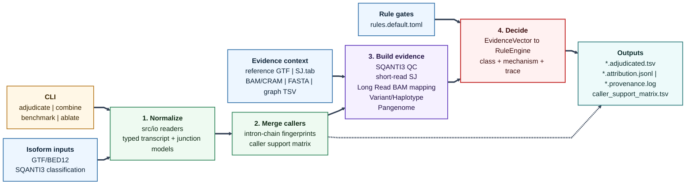

# PanIsoGuard

**Decides which novel isoforms from a long-read RNA-seq caller to trust, and records why.**

[](https://github.com/jibeomko/PanIsoGuard/actions/workflows/ci.yml)
[](LICENSE)

Long-read isoform callers (FLAIR, IsoQuant, Bambu, ESPRESSO, TALON, …) report many *novel*
isoforms, and not all of them are real. Some come from alignment errors or library artifacts;
others only look new because the sample's genome differs from the reference genome.
PanIsoGuard runs after the caller and [SQANTI3](https://github.com/ConesaLab/SQANTI3). For each
novel isoform it checks the evidence you give it (short-read splice junctions, the long-read
alignments, SQANTI3's QC, agreement between callers, the sample's own genome) and gives it one
of seven confidence classes. Each verdict comes with the likely cause when an isoform looks
like an artifact, the rules that decided it, and a log of the inputs that were used.

> **Status: alpha.** All the evidence types and commands below work and are tested. The
> default thresholds have been checked on one simulated data set so far.
>
> **What it is, and what it is not.** PanIsoGuard gives **verdicts you can trace**. It is
> **not a more accurate filter.** On simulated data with known answers, it ranks isoforms about
> as well as a one-line rule ("keep an isoform if every junction has at least 3 short reads").
> By default it prefers precision to recall, and without short reads it does worse than the
> SQANTI3 rules filter. See [How it compares](#how-it-compares).

## Contents

- [Quick start](#quick-start) · [Install](#install) · [Usage](#usage) · [Outputs](#outputs) · [Confidence classes](#confidence-classes) · [Evidence it uses](#evidence-it-uses)
- [Study notes](#study-notes) · [When to use PanIsoGuard](#when-to-use-panisoguard) · [How it compares](#how-it-compares) · [Design notes](#design-notes) · [Validation](#validation)
- [Runtime & memory](#runtime--memory) · [Documentation](#documentation) · [Repository layout](#repository-layout) · [Architecture map](#architecture-map)

## At a glance

![How PanIsoGuard judges a novel isoform, in five steps, followed for one example isoform, iso_B. 1, read inputs: the SQANTI3 classification, the caller's isoforms and the reference annotation are needed; short-read junctions (SJ.tab), a long-read BAM, genome haplotypes and a caller-support matrix are optional. 2, find novel junctions: iso_B has one junction that is not in the reference. 3, gather evidence: short reads support it; long reads and SQANTI3 QC find no artifact signal; callers and genome were not given, so they are not evaluated. 4, apply fixed rules: reference bias is checked first (not evaluated here); then short-read support times artifact signal gives the class, and iso_B lands on supported with no artifact signal. 5, report the verdict: confirmed novel (the other outcomes are reference bias, unconfirmed and artifact), written to a verdict table, the reasons and a run log.](docs/figures/overview.png)

To see these steps worked through on a small example gene, one note per step, read the
[study notes](notes/README.md) (in Korean).

## Quick start

Paste this into a Linux (or macOS) terminal. You only need `git` and `conda` (Miniconda,
Miniforge or Mamba). Everything else, including the C++ compiler and htslib, is installed into
a new conda environment, so you do not need a system compiler or htslib. The first run
downloads these (a few minutes); after that, the two examples run offline in under a second.

```bash
git clone https://github.com/jibeomko/PanIsoGuard.git
cd PanIsoGuard
conda create -y -n panisoguard --override-channels -c conda-forge -c bioconda \
    cxx-compiler c-compiler cmake make zlib "htslib>=1.18"
conda activate panisoguard

cmake -S . -B build -DCMAKE_BUILD_TYPE=Release
cmake --build build -j

examples/tiny/run.sh            # one caller: a known, a short-read-supported novel, and an artifact isoform
examples/multi_caller/run.sh    # three callers: combine -> consensus verdict
```

Each example prints its verdicts, compares them with the saved results in its `expected/`
folder, and ends with `example output matches expected files` (tiny) or
`output matches expected` (multi_caller). `--override-channels` makes conda use only
conda-forge and bioconda, whatever your own conda settings are. The program is now
`build/panisoguard`, and it runs without activating the environment. To call it as just
`panisoguard`, as in [Usage](#usage), run `export PATH="$PWD/build:$PATH"`.

**No conda? Use Docker** (from the same `PanIsoGuard` folder):

```bash
docker build -t panisoguard .
docker run --rm -u "$(id -u):$(id -g)" -v "$PWD":/work -w /work panisoguard examples/tiny/run.sh
docker run --rm -u "$(id -u):$(id -g)" -v "$PWD":/work -w /work panisoguard examples/multi_caller/run.sh
```

`-u` runs the container as your user, so it can write results into your folder. The image also
includes the optional PDF report tool. Without Docker, install that with `pip install ./python`
and run `panisoguard-report --prefix <out-prefix>` (see [python/](python/)).

For a step-by-step walk-through of one toy gene, from input files to verdicts, see the
[study notes](#study-notes) (in Korean).

## Install

### Bioconda

The Bioconda recipe is in [`recipes/bioconda/`](recipes/bioconda/). It has been submitted
([bioconda-recipes #65953](https://github.com/bioconda/bioconda-recipes/pull/65953)) and is
waiting for review. Once it is merged, you can install PanIsoGuard with:

```bash
conda install -c conda-forge -c bioconda panisoguard
```

### Container

Build the image once with `docker build -t panisoguard .` (see [Quick start](#quick-start)).
Then mount your data folder and give the command after the image name; it must start with
`panisoguard` (or `panisoguard-report`):

```bash
docker run --rm -u "$(id -u):$(id -g)" -v "$PWD":/data -w /data panisoguard \
    panisoguard adjudicate --classification cls.txt --isoforms-gtf iso.gtf --ref-gtf ref.gtf --out-prefix run
docker run --rm -u "$(id -u):$(id -g)" -v "$PWD":/data -w /data panisoguard \
    panisoguard-report --prefix run
```

### From source

The [Quick start](#quick-start) already builds from source, inside conda. To use your own
compiler instead, you need a C++17 compiler, CMake 3.20 or newer, and **htslib 1.18 or newer**.
The htslib in many Linux distributions is too old; conda avoids that problem. CMake looks for
htslib in `$CONDA_PREFIX`; otherwise pass `-DCMAKE_PREFIX_PATH=/path/to/prefix`.

```bash
cmake -S . -B build -DCMAKE_BUILD_TYPE=Release
cmake --build build -j
ctest --test-dir build            # unit, integration and example tests
./build/panisoguard --version
```

## Usage

`adjudicate` is the main command. It needs three inputs:

- `--classification`: the SQANTI3 classification file.
- `--isoforms-gtf` or `--isoforms-bed`: the caller's isoforms, with the same isoform IDs as the
  classification file.
- `--out-prefix`: where to write the results.

Also give `--ref-gtf`, the annotation you gave SQANTI3. Without it no junction can be
recognized as novel, and every novel isoform ends up `AMBIGUOUS`. All other inputs are
optional; each one adds one more kind of evidence (see [Evidence it uses](#evidence-it-uses)).
PanIsoGuard works with any caller and any organism. The file names below are placeholders for
your own files.

**Minimal** — SQANTI3 output only. With no read evidence, novel isoforms can be flagged or held
for review, but never confirmed:

```bash
panisoguard adjudicate \
  --classification classification.txt \
  --isoforms-bed   isoforms.bed \
  --ref-gtf        annotation.gtf \
  --out-prefix     out/sample
```

**Recommended** — add the short-read junctions from STAR (`--sj-tab`) and the long-read
alignments (`--bam`). These two are what let PanIsoGuard confirm or reject a novel isoform.
`--reference`, the genome FASTA, is needed only for CRAM input and for the haplotype check
below:

```bash
panisoguard adjudicate \
  --classification classification.txt \
  --isoforms-bed   isoforms.bed \
  --ref-gtf        annotation.gtf \
  --sj-tab         SJ.out.tab \
  --bam            aligned.bam \
  --reference      genome.fa \
  --out-prefix     out/sample
```

**Reference-bias check with the sample's haplotypes** — a splice site can look non-canonical on
the reference genome (for example GT…AC) but be canonical (GT…AG) in the sample, because of a
variant. Give the sample's haplotype sequences with `--reference-haplotype` (once per
haplotype), and PanIsoGuard reports such isoforms as reference bias instead of artifacts. Say
where the haplotypes came from with `--haplotype-provenance`. Only `wgs` or `external` (built
from DNA sequencing or another independent source) can lead to the reference-bias verdict. With
`rna_derived` or `unknown` the isoform is held as `AMBIGUOUS`, because haplotypes built from the
same RNA reads cannot independently explain those reads. This guard is called the circularity
firewall.

```bash
panisoguard adjudicate \
  --classification classification.txt \
  --isoforms-bed   isoforms.bed \
  --ref-gtf        annotation.gtf \
  --reference      genome.fa \
  --reference-haplotype haplotype1.fa \
  --reference-haplotype haplotype2.fa \
  --haplotype-provenance wgs \
  --out-prefix     out/sample
```

**Reference-bias check with a pangenome** (tested on HPRC v1.1 chr22) — instead of the sample's
own haplotypes, give splice junctions taken from a pangenome graph such as HPRC (extracted
beforehand, for example with vg/rpvg). If **every** novel junction of an isoform is found on
some haplotype of the pangenome, the isoform is reported as reference bias. This counts as
independent evidence only if the junctions come from population assemblies, so
`--pangenome-provenance` works like `--haplotype-provenance`: `population` or `external` can
lead to the verdict, while the default `unknown` (or `sample_derived`) holds the isoform as
`AMBIGUOUS`.

```bash
panisoguard adjudicate \
  --classification classification.txt \
  --isoforms-bed   isoforms.bed \
  --ref-gtf        annotation.gtf \
  --pangenome-junctions pangenome_junctions.tsv \
  --pangenome-provenance population \
  --out-prefix     out/sample
```

**Several callers** (optional) — if you ran more than one caller, `combine` matches their
isoforms by intron chain (the same chain of introns counts as the same isoform) and writes a
table of which callers found each one. Give this table to `adjudicate` with `--caller-support`:

```bash
panisoguard combine \
  --gtf flair:flair.gtf \
  --gtf isoquant:isoquant.gtf \
  --gtf bambu:bambu.gtf \
  --ref-gtf annotation.gtf \
  --out caller_support_matrix.tsv
```

> `combine` does the same N-way intron-chain comparison as `gffcompare -i` and gives exactly
> the same result; combining callers is common practice, not a PanIsoGuard invention. What it
> adds is that caller agreement becomes one piece of evidence in the verdict. What is new in
> PanIsoGuard is the reference-bias check and its guard against circular evidence; see
> [docs/relationship_to_merge_tools.md](docs/relationship_to_merge_tools.md).

### Outputs

`adjudicate` writes three files whose names start with your `--out-prefix`:

| File | What is in it |
|------|----------|
| `<prefix>.adjudicated.tsv`   | one row per isoform: the confidence class, the short-read support level, the main artifact cause (if any), and novel-junction counts |
| `<prefix>.attribution.jsonl` | one JSON record per isoform: all the evidence that was used, the `rule_trace` (the rules that decided the verdict, in order), a `graph_trace` (the same result seen as a splice graph; see [docs/method_graph.md](docs/method_graph.md)), and `bio_flags` (SQANTI3 QC values copied through for reference; they do not change the verdict; see [docs/relationship_to_sqanti3.md](docs/relationship_to_sqanti3.md)) |
| `<prefix>.provenance.log`    | how the run was done: tool and rule versions, the thresholds, which evidence was used, whether any input could make the evidence circular, and how many isoforms got each class |

Here is what the verdicts look like for four isoforms of the notes' toy gene (real output of one
run with short reads, a long-read BAM and two haplotypes). The outlined evidence is what
decided each verdict.

![Verdict examples: a table of four novel isoforms of a toy gene. For each, the evidence PanIsoGuard checks (short reads, long reads, SQANTI3 QC, genome) is marked as supports, partly, against or nothing found, followed by the verdict and its class, with the evidence that decided it outlined: iso_B confirmed novel (junction in 12 short reads), iso_C unconfirmed (1 of 2 junctions confirmed), iso_G artifact (no short reads and an indel beside the junction), iso_A reference bias (non-canonical only on the reference genome, canonical on the person's haplotype).](docs/figures/verdict_examples.png)

### Confidence classes

Every isoform gets one of seven classes. The figures group the six classes for novel isoforms
into four verdicts.

| Class | Verdict in the figures | Meaning |
|---|---|---|
| `HIGH_CONF_KNOWN` | — | Not novel: matches a known transcript exactly (SQANTI3 FSM). |
| `HIGH_CONF_NOVEL` | Confirmed novel | Short reads confirm every novel junction, and there is no sign of an artifact. |
| `MEDIUM_CONF_NOVEL` | Confirmed novel | Short reads confirm every novel junction, but there is a sign of an artifact. Or short-read support could not be checked, but at least 2 callers found the same isoform and there is no sign of an artifact. |
| `LOW_CONF_PARTIAL` | Unconfirmed | Not confirmed: short reads confirm only some of the novel junctions; or none of them, but there is no sign of an artifact either; or only callers agree and there is a sign of an artifact. Partial matches to a known transcript (SQANTI3 ISM) also get this class. |
| `PAN_REF_RESCUED_FALSE_NOVEL` | Reference bias | The junction only looks new or non-canonical because the sample's genome differs from the reference, as shown by the sample's haplotypes or a pangenome. |
| `AMBIGUOUS` | Unconfirmed | Not enough evidence to decide, for example when no short reads were given. Also used when a reference-bias explanation rests on data that is not independent, and for SQANTI3 categories that PanIsoGuard does not judge (such as genic, antisense, fusion or intergenic). |
| `ARTIFACT` | Artifact | Probably not real: short reads confirm none of the novel junctions, and there is a sign of an artifact. When short-read support cannot be checked, a long-read alignment problem alone is enough. |

The signs of an artifact are checked in this order, and the first one found is reported:
problems in the long-read alignments at the junction (`mapping_or_repeat`), a non-canonical
splice site (`noncanonical`), reverse-transcriptase template switching (`rt_switch`), and an
A-rich stretch right after the 3′ end (`degradation`). The reference-bias checks come before
all of these. Details: [docs/decision_engine.md](docs/decision_engine.md).

### Evidence it uses

| Evidence | Input | Needed? | What PanIsoGuard checks |
|---|---|---|---|
| SQANTI3 QC | `--classification` | required | the structural category, and three artifact signs from SQANTI3's columns: non-canonical splice site, RT template switching, A-rich 3′ end |
| Short reads | `--sj-tab` (STAR `SJ.out.tab`) | recommended | whether short reads confirm each novel junction; by default that takes at least 3 uniquely mapped reads and a canonical splice motif |
| Long reads | `--bam` | recommended | whether the reads across each novel junction look misaligned: by default, more than half of them share one problem (low mapping quality, a supplementary alignment, or an indel next to the junction). Soft-clipping is measured but not used by default. The defaults suit PacBio HiFi; ONT reads need different thresholds. |
| Caller agreement | `--caller-support` (from `combine`) | optional | how many callers found the same intron chain; used only when short-read support cannot be checked |
| Sample's genome | `--reference` and `--reference-haplotype` | optional | whether a variant makes a non-canonical splice site canonical in the sample (reference bias) |
| Pangenome | `--pangenome-junctions` | optional | whether every novel junction is found in a pangenome (reference bias; tested on HPRC v1.1 chr22) |

### All commands

| Command | What it does |
|---------|---------|
| `adjudicate` | gives each isoform a confidence class, the likely artifact cause, and the reasons (3 output files) |
| `benchmark`  | compares PanIsoGuard's calls on novel isoforms with the SQANTI3 filter (2×2 table, Jaccard index, McNemar test) |
| `ablate`     | turns off one kind of evidence at a time and shows which calls change |
| `combine`    | matches several callers' isoforms by intron chain and writes which callers found each one |
| `version`    | shows the version, the linked htslib, and the built-in features |

Run `panisoguard <command> --help` for all options. Input file formats:
[docs/input_formats.md](docs/input_formats.md).

#### Benchmarking and ablation

```bash
# compare with the SQANTI3 filter on novel isoforms (2x2 table, Jaccard, McNemar)
panisoguard benchmark [adjudicate options] --out bench/

# which calls change when one kind of evidence is turned off
panisoguard ablate    [adjudicate options] --axes short_read,mapping,variant --out abl/
```

## Study notes

The [study notes](notes/README.md) (in Korean) explain how PanIsoGuard reaches its verdicts by
following one small example through every step: a gene on a 1,700 bp toy chromosome, with three
reference transcripts and nine isoforms from a caller. Each note starts from one question and
shows the example before the rule. Every code block was run and shows its real output, and the
CTest `integration_study_notes` checks that the notes still match the program. Read them in
order if you are new:

| # | Question | What it covers |
|---|---|---|
| 00 | [What does PanIsoGuard ask about a novel isoform?](notes/00_overview.md) | what is judged, and the steps from input files to verdict |
| 01 | [What exactly is new in a novel isoform?](notes/01_intron_chain_and_novelty.md) | intron chains, each file's coordinate convention, counting novel junctions |
| 02 | [How do we know short reads saw a novel junction?](notes/02_short_read_support.md) | `SJ.out.tab`, the four support levels, the `PARTIAL` rule change |
| 03 | [What traces do artifacts leave?](notes/03_artifact_mechanisms.md) | SQANTI3's QC values, the four long-read BAM signs, which sign wins |
| 04 | [How do support and artifact signs become one class?](notes/04_projection.md) | the support × artifact grid, the checks before it, `ablate`, all rules re-implemented in Python |
| 05 | [What changes when the reference differs from the person's genome?](notes/05_reference_bias.md) | reference bias from haplotypes and a pangenome, the circularity firewall, the limits of its validation |
| 06 | [If several callers find the same isoform, can we trust it?](notes/06_multi_caller_consensus.md) | intron-chain fingerprints, `combine`, strengths and weaknesses of caller agreement |
| 07 | [How do we measure whether the verdicts are right?](notes/07_evaluation.md) | simulated truth, precision, recall and AUPRC, the comparison with a one-line rule |
| 08 | [How does one isoform become one class?](notes/08_one_isoform_end_to_end.md) | working out one isoform by hand, from input files to class, and checking it against PanIsoGuard |

## When to use PanIsoGuard

Use it when you have **novel** long-read isoforms and want to know **why** each one is trusted
or not. If you only need a filtered GTF, the SQANTI3 rules filter (or keeping the isoforms whose
junctions all have short-read support) is just as accurate and simpler; see
[How it compares](#how-it-compares).

- **You ran more than one caller** (FLAIR, IsoQuant, Bambu, ESPRESSO, TALON, …) and they
  disagree about the novel isoforms. PanIsoGuard matches isoforms across callers by their
  intron chains and records how many callers found each one. Novel isoforms found by only one
  caller are mostly artifacts; agreement between callers is a strong sign that an isoform is
  real, whichever matching rule is used ([benchmark/multicaller](benchmark/multicaller)).
- **You want a clear class and reason for each novel isoform**, not just a filtered GTF. Each
  isoform gets one of 7 classes and a `rule_trace` that scripts can read (plus an optional
  [PDF report](python/README.md)). You can keep `HIGH_CONF_NOVEL` and `MEDIUM_CONF_NOVEL` and
  review the rest, instead of looking at reads one by one.
- **You have the sample's haplotypes or a pangenome** and want to find *reference-bias*
  junctions: junctions that look non-canonical on the reference genome but are canonical in the
  sample. A built-in guard refuses to use the sample's own RNA as proof. Expect only a few such
  junctions (about 30–45 in a genome that differs a lot from the reference). On two such
  genomes, a phasing check agreed for 27 of 28 testable heterozygous junctions: the reads that
  use the junction come from the haplotype on which it is canonical
  ([benchmark/refbias_phasing](benchmark/refbias_phasing)). Homozygous junctions cannot be
  checked this way.

**It is not an isoform caller, and it does not redo SQANTI3's QC.** It runs after the callers
and uses SQANTI3's results as they are
([docs/relationship_to_sqanti3.md](docs/relationship_to_sqanti3.md)). Its `combine` step
reimplements `gffcompare -i`; it is not a new way to merge isoforms
([docs/relationship_to_merge_tools.md](docs/relationship_to_merge_tools.md)).

## How it compares

Test data: simulated reads with known answers (SQANTI-SIM on GENCODE v49 chr22, FLAIR +
SQANTI3), 870 isoforms that do not fully match a known transcript (730 real, 140 false). All
methods got the same inputs. "1M" means 1 million simulated Illumina read pairs aligned with
STAR. AUPRC measures how well a method ranks real isoforms above false ones (1 is perfect).
Full tables, bootstrap confidence intervals and caveats are in
[benchmark/sqanti3_filter_h2h](benchmark/sqanti3_filter_h2h).

| short reads | method | precision | recall | F1 | AUPRC |
|---|---|---:|---:|---:|---:|
| none | SQANTI3 rules filter | 0.918 | 0.886 | **0.902** | **0.909** |
| none | PanIsoGuard | — (0 calls) | 0.000 | — | 0.824 |
| none | PanIsoGuard + BAM | — (0 calls) | 0.000 | — | 0.875 |
| 1M | SQANTI3 rules filter | 0.918 | 0.890 | 0.904 | 0.909 |
| 1M | every junction ≥ 3 short reads | 0.976 | **0.945** | **0.960** | 0.968 |
| 1M | PanIsoGuard | **0.990** | 0.545 | 0.703 | 0.968 |
| 1M | PanIsoGuard + BAM | **0.990** | 0.545 | 0.703 | **0.977** |

- PanIsoGuard is the most precise, but it keeps fewer of the real isoforms (low recall). It
  holds back on NIC isoforms that only combine known junctions (there is no new junction to
  confirm) and on ISM isoforms.
- For ranking (AUPRC) it ties the one-line short-read rule. The BAM check adds about 0.01, and
  that gain is significant only at the lowest short-read depth.
- Without short reads it confirms nothing, unless you give it caller agreement
  (`--caller-support`).

So use it for the reason behind each call, not for a better score.

## Design notes

PanIsoGuard takes SQANTI3's QC values as they are and combines them with other, independent
evidence: caller agreement, short-read junctions, long-read alignments, the sample's
haplotypes, and pangenome junctions. It does not recompute TSS/TTS, ORF/NMD, polyA or reference
splice motifs, and it is not a SQANTI3-style QC filter (see
[docs/relationship_to_sqanti3.md](docs/relationship_to_sqanti3.md)). What it adds is the
**decision logic**: fixed, readable rules that turn the evidence into a verdict. The thresholds
are in [`config/rules.default.toml`](config/rules.default.toml) and can be changed without
rebuilding, and every verdict records its `rule_trace` (see
[docs/decision_engine.md](docs/decision_engine.md)).

> PanIsoGuard is an **independent project**; the SQANTI3 authors have not made or endorsed it.
> It only reads SQANTI3's output files. No SQANTI3 code is included or linked, so SQANTI3's
> GPL-3.0 license does not extend to PanIsoGuard's MIT code. If you use SQANTI3 in your
> pipeline, please cite it; see
> [docs/relationship_to_sqanti3.md](docs/relationship_to_sqanti3.md#attribution-licensing--citation).

You can also picture each isoform as a **path through its gene's splice graph**: a novel
junction is an edge that the reference graph does not have. This is only another way to
describe the same rules; there is no graph model or new algorithm. Each verdict also carries a
`graph_trace` in these terms (the number of novel edges, how many of them are supported, and
the distance from a known path). See [docs/method_graph.md](docs/method_graph.md).

## Validation

[docs/validation.md](docs/validation.md) lists what has been checked and what is planned
(SQANTI-SIM, HG002/HPRC, LRGASP).

**Thresholds.** On SQANTI-SIM (GENCODE v49 chr22), trying a grid of threshold values changes
AUPRC very little (0.970–0.971), and the default is within 0.0001 of the best
([benchmark/results/sqanti_sim/sweep.tsv](benchmark/results/sqanti_sim/sweep.tsv)). Other data
sets have not been tried yet.

**Pangenome.** The pangenome reference-bias check was tested on the real HPRC v1.1 chr22 graph
(GATE-1): no false rescues on real FLAIR novel junctions, correct rescues on real population
deletions, and the circularity guard held when the junction file was marked as not independent
([benchmark/pangenome](benchmark/pangenome)). It has been tested on chr22 only; reading the
graph (GBZ) directly is future work.

Read the confidence classes as an ordered scale of evidence (HIGH above MEDIUM above LOW), not
as probabilities.

## Runtime & memory

One thread, a whole-genome isoform set (GRCh38 + GENCODE v49):

| Step | Time | Peak RAM |
|------|------|----------|
| build the reference catalog (GENCODE v49) | ~3 s | ~0.34 GB |
| `adjudicate` (SQANTI3 + short-read junctions) | ~5 s | ~0.55 GB |
| + haplotype check (reads splice motifs with faidx) | ~40 s | ~0.6 GB |
| + long-read BAM check | ~1.6 min | ~0.6 GB |

The callers and the alignment take most of the total time; PanIsoGuard itself is fast.

## Orchestration (optional)

[`workflow/`](workflow/) has a Snakemake pipeline that runs several callers on one shared
alignment and then runs PanIsoGuard (`combine` + `adjudicate`). It is a convenience wrapper,
not part of the core tool.

## Documentation

| Doc | Contents |
|-----|----------|
| [docs/architecture.md](docs/architecture.md) | How the code is organized: command line → file readers → data model → evidence → decision. |
| [docs/algorithm.md](docs/algorithm.md) | How one isoform is judged, step by step. |
| [docs/function_io.md](docs/function_io.md) | What each module takes and returns, and the main data types. |
| [docs/decision_engine.md](docs/decision_engine.md) | The decision grid, which check comes first, and the guard against circular evidence. |
| [docs/method_graph.md](docs/method_graph.md) | The splice-graph view: an isoform is a path, a novel junction is a new edge, and the `graph_trace`. |
| [docs/relationship_to_sqanti3.md](docs/relationship_to_sqanti3.md) | What PanIsoGuard takes from SQANTI3 and what it does not recompute; the `bio_flags` pass-through. |
| [docs/relationship_to_merge_tools.md](docs/relationship_to_merge_tools.md) | How `combine` relates to gffcompare, TAMA and Bambu-NDR, and what is actually new in PanIsoGuard. |
| [docs/input_formats.md](docs/input_formats.md) | Every input file format and its options. |
| [docs/validation.md](docs/validation.md) | What has been checked and what is planned. |
| [CHANGELOG.md](CHANGELOG.md) · [docs/releasing.md](docs/releasing.md) | What changed in each version; how releases and Bioconda updates are made. |
| [notes/](notes/README.md) | Study notes (in Korean): one toy gene from input files to verdict, one step per note. Every code block was run and shows its real output; `notes/check_notes.py` (CTest `integration_study_notes`) checks that the notes still match the program. |

## Repository layout

```text
PanIsoGuard/
|-- README.md                       # overview, quick start, usage
|-- CMakeLists.txt                  # C++17/CMake build, install target, test wiring
|-- cmake/FindHTSlib.cmake          # finds htslib for source and conda builds
|-- config/rules.default.toml        # default thresholds and rule switches
|-- include/panisoguard/             # C++ headers, one interface per module
|   |-- types.hpp                    # Junction, IntronChain, Transcript, Evidence primitives
|   |-- adjudicator.hpp              # per-isoform evidence collection and decision API
|   |-- rules.hpp, verdict.hpp       # rule configuration, classes, mechanisms, rule traces
|   |-- consensus.hpp, fingerprint.hpp, interval_index.hpp
|   |-- gtf.hpp, bed12.hpp, sqanti.hpp, sj_tab.hpp, pangenome.hpp
|   `-- bam_features.hpp, variant_motif.hpp, result_writer.hpp
|-- src/
|   |-- cli/                         # commands: adjudicate, combine, benchmark, ablate
|   |-- io/                          # SQANTI/GTF/BED12/SJ/pangenome readers + result writer
|   |-- evidence/                    # BAM and FASTA evidence (via htslib)
|   `-- core/                        # caller matching, reference catalog, rules, verdicts
|-- tests/
|   |-- unit/                        # Catch2 tests, module by module
|   `-- data/tiny/                   # minimal BAM/GTF/BED/SQANTI/SJ/FASTA test files
|-- docs/                            # architecture, algorithm, input formats, validation plan
|-- docs/figures/                    # README figures (SVG sources + rendered PNGs)
|-- notes/                           # study notes (Korean): a toy gene followed through every step
|-- workflow/                        # optional Snakemake pipeline around PanIsoGuard
|-- benchmark/                       # benchmarks on simulated and real data, with results
|-- examples/                        # tiny and multi_caller (with expected outputs), report (PDF)
|-- recipes/bioconda/                # Bioconda meta.yaml and build.sh
|-- thirdparty/                      # bundled header-only libraries and their licenses
|-- LICENSE
`-- THIRDPARTY.txt
```

## Architecture map


```mermaid
%%{init: {"theme": "base", "themeCSS": "svg { background: #ffffff; }", "themeVariables": {"background": "#ffffff", "mainBkg": "#ffffff", "fontSize": "17px", "fontFamily": "Arial, sans-serif", "primaryTextColor": "#111827", "lineColor": "#334155", "arrowheadColor": "#334155"}, "flowchart": {"htmlLabels": true, "curve": "linear", "nodeSpacing": 24, "rankSpacing": 32}}}%%
flowchart LR
  CLI["<b>CLI</b><br/>adjudicate | combine<br/>benchmark | ablate"]
  Iso["<b>Isoform inputs</b><br/>GTF/BED12<br/>SQANTI3 classification"]
  Context["<b>Evidence context</b><br/>reference GTF | SJ.tab<br/>BAM/CRAM | FASTA | graph TSV"]
  Rules["<b>Rule gates</b><br/>rules.default.toml"]

  Normalize["<b>1. Normalize</b><br/>src/io readers<br/>typed transcript + junction models"]
  Consensus["<b>2. Merge callers</b><br/>intron-chain fingerprints<br/>caller support matrix"]
  Evidence["<b>3. Build evidence</b><br/>SQANTI3 QC<br/>short‑read SJ<br/>Long Read BAM mapping<br/>Variant/Haplotype<br/>Pangenome"]
  Decide["<b>4. Decide</b><br/>EvidenceVector to RuleEngine<br/>class + mechanism + trace"]
  Outputs["<b>Outputs</b><br/>*.adjudicated.tsv<br/>*.attribution.jsonl | *.provenance.log<br/>caller_support_matrix.tsv"]

  CLI --> Normalize
  Iso --> Normalize
  Normalize --> Consensus
  Consensus --> Evidence
  Evidence --> Decide
  Decide --> Outputs
  Context --> Evidence
  Rules --> Decide
  Consensus -.-> Outputs

  classDef command fill:#fff7e6,stroke:#b7791f,stroke-width:1.8px,color:#3a2500,font-size:17px;
  classDef input fill:#edf6ff,stroke:#2f6fa8,stroke-width:1.8px,color:#0f2438,font-size:17px;
  classDef process fill:#eefaf1,stroke:#2f855a,stroke-width:1.8px,color:#102a16,font-size:17px;
  classDef evidence fill:#f5f0ff,stroke:#6b46c1,stroke-width:2px,color:#241447,font-size:17px;
  classDef decision fill:#fff1f1,stroke:#c53030,stroke-width:2.2px,color:#3b0d0d,font-size:17px;
  classDef output fill:#edfafa,stroke:#2c7a7b,stroke-width:1.8px,color:#0f2f2f,font-size:17px;

  class CLI command;
  class Iso,Context,Rules input;
  class Normalize,Consensus process;
  class Evidence evidence;
  class Decide decision;
  class Outputs output;
  linkStyle default stroke:#334155,stroke-width:3.5px;
```

## License

PanIsoGuard is MIT-licensed; see [LICENSE](LICENSE).

It includes three small third-party header libraries in `thirdparty/`, with their license
texts: **cgranges** (`IITree.h`, MIT), **toml++** (MIT), and **Catch2** (Boost Software License
1.0, used only for tests). See [THIRDPARTY.txt](THIRDPARTY.txt). Taken together, the source as
distributed is under **MIT AND BSL-1.0**. htslib is linked as a separate dependency, not
included.
