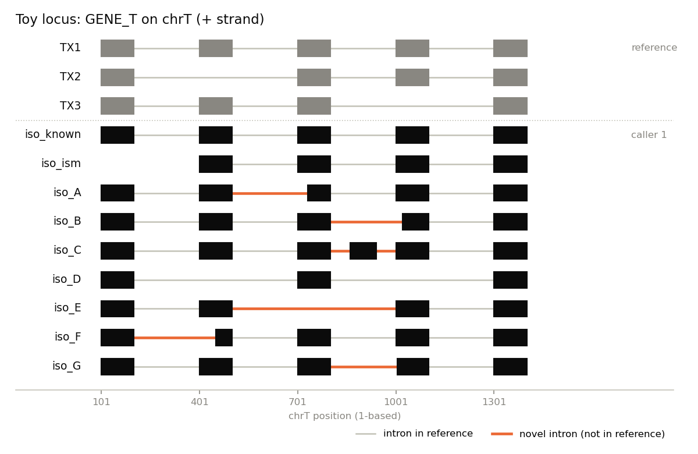

# 00. PanIsoGuard는 novel isoform 하나에 무엇을 물을까?

long-read RNA-seq에서 isoform caller(FLAIR, IsoQuant 등)를 돌리면 "주석에 없는 새 isoform"이 수백, 수천 개 나온다. 그중 몇 개가 진짜이고 몇 개가 정렬이나 시퀀싱이 만든 가짜일까? PanIsoGuard는 이 질문에 isoform마다 등급 하나와 그 이유를 붙여 주는 도구다. 그런데 결과표의 `confidence_class` 열만 보다 보니, 그 등급이 어떤 입력에서 어떤 규칙을 거쳐 나오는지 막상 설명하기 어려웠다. 이 시리즈는 작은 예제 유전자 하나를 끝까지 따라가면서 PanIsoGuard가 하는 일을 한 단계씩 직접 확인해 본 공부 기록이다. 첫 노트인 여기서는 전체 지도를 먼저 그리고, 시리즈 전체에서 같이 쓸 예제와 용어를 정리한다.

> 관련 문서: [README](../README.md), [docs/architecture.md](../docs/architecture.md), [docs/decision_engine.md](../docs/decision_engine.md) · 코드: [check_notes.py](check_notes.py)

## 1. 이 시리즈는 어떤 isoform을 끝까지 따라갈까?

실제 데이터는 isoform이 수천 개라 한 번에 따라가기 어렵다. 그래서 1,700 bp짜리 가상의 염색체 `chrT`에 유전자 하나(GENE_T, + strand)를 만들고, 판정에 필요한 입력을 전부 이 유전자 하나에 대해 만들어 두었다. 만드는 과정은 [data/make_toy.py](data/make_toy.py)와 [data/build_toy.sh](data/build_toy.sh)에 있다. 간단히 말하면 이렇다.

- 참조 주석(reference annotation)에는 전사체가 세 개 있다. 다섯 exon을 모두 쓰는 TX1, exon 2를 건너뛰는 TX2, exon 4를 건너뛰는 TX3이다.
- caller 1이 이 유전자에서 isoform 아홉 개를 불렀다고 가정했다. `iso_known`은 TX1과 같고, `iso_ism`은 TX1의 앞쪽이 잘린 조각이며, 나머지 일곱 개(`iso_A`–`iso_G`)가 주석에 없는 isoform이다.
- SQANTI3 분류표는 SQANTI3 6.0.1을 실제로 돌려서 얻었다. short-read junction 표(`SJ.out.tab`)는 시뮬레이션한 100 bp read를 STAR 2.7.11b로 정렬해서 얻었다. long-read 정렬(BAM)은 CIGAR를 손으로 적어서 만들었다.



회색 막대는 참조 전사체, 검은 막대는 caller가 부른 isoform의 exon이다. 주황색 선은 참조 주석의 어느 전사체에도 없는 intron, 곧 novel junction이다. `iso_D`는 주석에 없는 isoform인데도 주황색 선이 없다. 이 점은 [01](01_intron_chain_and_novelty.md)에서 다시 본다.

<details>
<summary>그림을 만든 코드</summary>

```python
import matplotlib
matplotlib.use("Agg")
import matplotlib.pyplot as plt

def exons_of(path):
    tx = {}
    for line in open(path):
        f = line.rstrip("\n").split("\t")
        if len(f) > 8 and f[2] == "exon":
            tid = f[8].split('transcript_id "')[1].split('"')[0]
            tx.setdefault(tid, []).append((int(f[3]), int(f[4])))
    return {t: sorted(e) for t, e in tx.items()}

ref, iso = exons_of("data/reference.gtf"), exons_of("data/caller1.gtf")
known = {(e[i][1] + 1, e[i + 1][0] - 1) for e in ref.values() for i in range(len(e) - 1)}

INK, MUTED, GRID, NOVEL = "#0b0b0b", "#898781", "#c3c2b7", "#eb6834"
rows = list(ref.items()) + [(t, iso[t]) for t in ["iso_known", "iso_ism", "iso_A", "iso_B", "iso_C",
                                                   "iso_D", "iso_E", "iso_F", "iso_G"]]
fig, ax = plt.subplots(figsize=(8, 5.2), dpi=150)
for y, (name, ex) in enumerate(reversed(rows)):
    for i in range(len(ex) - 1):
        a, b = ex[i][1] + 1, ex[i + 1][0] - 1
        new = (a, b) not in known
        ax.plot([ex[i][1], ex[i + 1][0]], [y, y], color=NOVEL if new else GRID,
                lw=2.2 if new else 1.2, zorder=1)
    for a, b in ex:
        ax.add_patch(plt.Rectangle((a, y - 0.28), b - a + 1, 0.56, color=INK if name.startswith("iso") else MUTED, zorder=2))
    ax.text(40, y, name, ha="right", va="center", fontsize=9, color=INK)
ax.axhline(len(rows) - len(ref) - 0.5, color=GRID, lw=0.8, ls=":")
ax.text(1720, len(rows) - 1, "reference", va="center", fontsize=8, color=MUTED)
ax.text(1720, len(rows) - len(ref) - 1, "caller 1", va="center", fontsize=8, color=MUTED)
ax.plot([], [], color=GRID, lw=1.2, label="intron in reference")
ax.plot([], [], color=NOVEL, lw=2.2, label="novel intron (not in reference)")
ax.legend(frameon=False, fontsize=8, loc="lower right", bbox_to_anchor=(1.0, -0.16), ncol=2)
ax.set_xlim(-160, 1850); ax.set_ylim(-0.8, len(rows) - 0.4)
ax.set_yticks([]); ax.set_xticks([101, 401, 701, 1001, 1301])
ax.tick_params(colors=MUTED, labelsize=8)
for s in ("top", "right", "left"):
    ax.spines[s].set_visible(False)
ax.spines["bottom"].set_color(GRID)
ax.set_xlabel("chrT position (1-based)", color=MUTED, fontsize=8)
ax.set_title("Toy locus: GENE_T on chrT (+ strand)", color=INK, loc="left", fontsize=11)
fig.tight_layout()
fig.savefig("figures/00_toy_locus.png", dpi=150, facecolor="white")
print("novel introns per isoform:", {t: sum((e[i][1] + 1, e[i + 1][0] - 1) not in known for i in range(len(e) - 1)) for t, e in iso.items()})
```

```text
novel introns per isoform: {'iso_known': 0, 'iso_ism': 0, 'iso_A': 1, 'iso_B': 1, 'iso_C': 2, 'iso_D': 0, 'iso_E': 1, 'iso_F': 1, 'iso_G': 1}
```

`notes/` 폴더에서 실행했다.

</details>

입력 파일은 모두 [data/](data/)에 있다. SQANTI3가 이 아홉 개를 어떻게 분류했는지부터 본다. 이 노트의 bash 블록은 `notes/` 폴더에서 `PIG=../build/panisoguard`로 두고 실행했다.

```bash
PIG=../build/panisoguard; mkdir -p out
ls data | paste -sd' '
cut -f1,7,8,9 data/caller1_classification.txt | column -t
```

```text
build_toy.sh caller1_classification.txt caller1.gtf caller2.gtf hap1.fa hap1.fa.fai hap2.fa hap2.fa.fai long_reads.bam long_reads.bam.bai long_reads.sam make_toy.py reference.gtf short_reads.fq short_reads.SJ.out.tab toy.fa toy.fa.fai
isoform    exons  structural_category      subcategory
iso_A      5      novel_not_in_catalog     at_least_one_novel_splicesite
iso_B      5      novel_not_in_catalog     at_least_one_novel_splicesite
iso_C      6      novel_not_in_catalog     at_least_one_novel_splicesite
iso_D      3      novel_in_catalog         combination_of_known_junctions
iso_E      4      novel_in_catalog         combination_of_known_splicesites
iso_F      5      novel_not_in_catalog     at_least_one_novel_splicesite
iso_G      5      novel_not_in_catalog     at_least_one_novel_splicesite
iso_ism    4      incomplete-splice_match  3prime_fragment
iso_known  5      full-splice_match        reference_match
```

`structural_category`는 SQANTI3가 isoform마다 붙이는 구조 범주다. 이 시리즈에 나오는 네 가지만 정리해 두면 이렇다.

| 범주 | 줄임말 | 뜻 |
|---|---|---|
| `full-splice_match` | FSM | intron chain 전체가 참조 전사체 하나와 같음 |
| `incomplete-splice_match` | ISM | 참조 전사체의 intron chain 일부와 같음 (앞이나 뒤가 잘린 조각) |
| `novel_in_catalog` | NIC | 이미 알려진 splice site만 쓰지만, 그 조합이 새로움 |
| `novel_not_in_catalog` | NNC | 알려지지 않은 splice site를 적어도 하나 씀 |

PanIsoGuard가 판정 대상으로 삼는 "novel isoform"은 NIC와 NNC다. 이 예제에서는 `iso_D`, `iso_E`가 NIC, 나머지 다섯 개(`iso_A`, `iso_B`, `iso_C`, `iso_F`, `iso_G`)가 NNC다.

이 시리즈의 주인공은 `iso_A`다. exon 2 끝(500)에서 exon 3 안쪽(731)으로 바로 이어지는 novel junction 하나를 가진 isoform인데, 입력을 하나씩 더할 때마다 판정이 바뀐다. 도착점은 아래 표다. 지금은 표 속 용어를 몰라도 괜찮다. 한 줄씩 뒤 노트에서 직접 확인한다.

```bash
B="--classification data/caller1_classification.txt --isoforms-gtf data/caller1.gtf"
R="--ref-gtf data/reference.gtf"; S="--sj-tab data/short_reads.SJ.out.tab"; M="--bam data/long_reads.bam"
H="--reference data/toy.fa --reference-haplotype data/hap1.fa --reference-haplotype data/hap2.fa"
i=0
for extra in "" "$R" "$R $S" "$R $S $M" "$R $S $M $H" "$R $S $M $H --haplotype-provenance wgs"; do
  $PIG adjudicate $B $extra --out-prefix out/step$i 2>/dev/null
  printf 'step%d  %s\n' $i "$(grep -P '^iso_A\t' out/step$i.adjudicated.tsv | cut -f5-8,10 | tr '\t' ' ')"
  i=$((i+1))
done
```

```text
step0  UNKNOWN noncanonical AMBIGUOUS 0 false
step1  UNKNOWN noncanonical AMBIGUOUS 1 false
step2  UNSUPPORTED noncanonical ARTIFACT 1 false
step3  UNSUPPORTED noncanonical ARTIFACT 1 false
step4  UNKNOWN variant_created AMBIGUOUS 1 true
step5  UNKNOWN variant_created PAN_REF_RESCUED_FALSE_NOVEL 1 false
```

출력 열은 차례로 novelty support, primary mechanism, confidence class, novel junction 수, circularity flag이다.

| 단계 | 더한 입력 | `iso_A`의 판정 | 자세히 다루는 노트 |
|---|---|---|---|
| step0 | SQANTI3 분류표 + caller GTF | `AMBIGUOUS` (무엇이 새로운지 알 수 없음) | [01](01_intron_chain_and_novelty.md) |
| step1 | + 참조 GTF | `AMBIGUOUS` (novel junction 1개를 찾았지만 확인할 증거가 없음) | [01](01_intron_chain_and_novelty.md) |
| step2 | + short-read `SJ.out.tab` | `ARTIFACT` (short read 지지 없음 + non-canonical motif) | [02](02_short_read_support.md), [04](04_projection.md) |
| step3 | + long-read BAM | `ARTIFACT` (mapping 문제는 없음) | [03](03_artifact_mechanisms.md) |
| step4 | + 개인 haplotype FASTA 두 개 (출처 unknown) | `AMBIGUOUS` (reference bias로 설명되지만 출처가 불확실해 보류) | [05](05_reference_bias.md) |
| step5 | + 출처를 `wgs`로 명시 | `PAN_REF_RESCUED_FALSE_NOVEL` | [05](05_reference_bias.md) |

같은 isoform 하나가 입력에 따라 `AMBIGUOUS`에서 `ARTIFACT`로, 다시 "reference bias로 설명되는 가짜 novelty"로 바뀐다. 이 시리즈가 풀려는 것이 바로 이 표다. 각 단계에서 PanIsoGuard가 무엇을 보고, 왜 판정을 바꾸는지다. [08](08_one_isoform_end_to_end.md)에서는 이 표를 PanIsoGuard 없이 Python으로 처음부터 다시 계산해서 맞춰 본다.

## 2. PanIsoGuard는 무엇을 판정할까?

PanIsoGuard는 isoform을 새로 부르는 caller가 아니다. 이미 caller가 부른 isoform과 SQANTI3 분류표를 받아서, novel isoform마다 세 가지를 붙여 준다.

1. **confidence class**: 이 novel isoform을 얼마나 믿을지 나타내는 등급 하나.
2. **primary mechanism**: 믿기 어렵다면 어떤 artifact 기전이 의심되는지(`noncanonical`, `mapping_or_repeat` 등). 아무것도 걸리지 않으면 `none`이다.
3. **rule_trace**: 판정까지 거친 규칙을 순서대로 적은 기록.

등급은 일곱 가지다.

| confidence class | 뜻 |
|---|---|
| `HIGH_CONF_KNOWN` | 이미 알려진 isoform(FSM)이라 판정할 것이 없음 |
| `HIGH_CONF_NOVEL` | novel junction이 모두 독립 증거로 확인되고 artifact 흔적도 없음 |
| `MEDIUM_CONF_NOVEL` | 확인은 되었지만 artifact 흔적이 하나 있거나, short read 대신 caller 여러 개의 합의로만 확인됨 |
| `LOW_CONF_PARTIAL` | novel junction 일부만 확인됨, 확인이 안 됐지만 artifact 흔적도 없음, 또는 ISM |
| `PAN_REF_RESCUED_FALSE_NOVEL` | 새로워 보이는 이유가 참조 게놈과 개인 게놈의 차이(reference bias)로 설명됨 |
| `AMBIGUOUS` | 판정할 증거가 없음. reference bias로 설명되지만 그 근거의 출처가 불확실할 때도 여기로 보류함 |
| `ARTIFACT` | 확인이 안 되고 artifact 흔적까지 있음 |

반대로 PanIsoGuard가 하지 않는 일도 있다. SQANTI3의 QC 값(splice motif, RT switching, poly-A 등)을 다시 계산하지 않고 SQANTI3가 적어 준 값을 그대로 쓴다. 그리고 이 등급은 확률이 아니다. `HIGH`가 `MEDIUM`보다 믿을 만하다는 순서만 있는 서열 척도다([07](07_evaluation.md)).

## 3. 한 번 돌려 보면 무엇이 나올까?

참조 GTF, short-read junction, long-read BAM까지 넣고 돌려 본다. 위 표의 step3과 같은 입력이다.

```bash
$PIG adjudicate \
  --classification data/caller1_classification.txt \
  --isoforms-gtf   data/caller1.gtf \
  --ref-gtf        data/reference.gtf \
  --sj-tab         data/short_reads.SJ.out.tab \
  --bam            data/long_reads.bam \
  --out-prefix     out/toy
cut -f1,4-9 out/toy.adjudicated.tsv | column -t
```

```text
read 9 SQANTI records (54 cols)
read 9 caller isoform chains
building reference catalog...
read 10 short-read junctions
opened BAM for mapping axis: data/long_reads.bam
adjudicated 9 isoforms:
  AMBIGUOUS                    1
  ARTIFACT                     3
  HIGH_CONF_KNOWN              1
  HIGH_CONF_NOVEL              2
  LOW_CONF_PARTIAL             2
wrote out/toy.{adjudicated.tsv,attribution.jsonl,provenance.log}
isoform_id  structural_category      novelty_support  primary_mechanism  confidence_class  n_novel_junctions  n_novel_jx_sr_supported
iso_A       novel_not_in_catalog     UNSUPPORTED      noncanonical       ARTIFACT          1                  0
iso_B       novel_not_in_catalog     SUPPORTED        none               HIGH_CONF_NOVEL   1                  1
iso_C       novel_not_in_catalog     PARTIAL          none               LOW_CONF_PARTIAL  2                  1
iso_D       novel_in_catalog         UNKNOWN          none               AMBIGUOUS         0                  0
iso_E       novel_in_catalog         SUPPORTED        none               HIGH_CONF_NOVEL   1                  1
iso_F       novel_not_in_catalog     UNSUPPORTED      noncanonical       ARTIFACT          1                  0
iso_G       novel_not_in_catalog     UNSUPPORTED      mapping_or_repeat  ARTIFACT          1                  0
iso_ism     incomplete-splice_match  UNKNOWN          none               LOW_CONF_PARTIAL  0                  0
iso_known   full-splice_match        SUPPORTED        none               HIGH_CONF_KNOWN   0                  0
```

위의 여덟 줄은 진행 로그(stderr)이고, 판정은 세 파일에 나뉘어 저장된다.

| 파일 | 내용 |
|---|---|
| `out/toy.adjudicated.tsv` | isoform마다 한 줄. 위에 출력한 표 |
| `out/toy.attribution.jsonl` | isoform마다 JSON 한 줄. 판정에 쓴 증거 전체와 `rule_trace` |
| `out/toy.provenance.log` | 어떤 입력이 들어왔고 어떤 증거 축이 켜졌는지, 등급별 개수 |

표만 봐서는 `iso_C`가 왜 `LOW_CONF_PARTIAL`인지 알 수 없다. 이유는 JSON 쪽에 있다.

```python
import json
for line in open("out/toy.attribution.jsonl"):
    r = json.loads(line)
    if r["isoform"] == "iso_C":
        print("confidence_class:", r["confidence_class"])
        print("evidence:", {k: r["evidence"][k] for k in ("n_novel_junctions", "n_novel_jx_sr_supported", "noncanonical", "bam_n_spanning", "bam_frac_indel_near")})
        print("rule_trace:")
        for t in r["rule_trace"]:
            print("  ", t)
```

```text
confidence_class: LOW_CONF_PARTIAL
evidence: {'n_novel_junctions': 2, 'n_novel_jx_sr_supported': 1, 'noncanonical': False, 'bam_n_spanning': 10, 'bam_frac_indel_near': 0}
rule_trace:
   sj_support=1/2 -> PARTIAL
   no artifact mechanism flagged -> mechanism=none
   project(PARTIAL,none) -> LOW_CONF_PARTIAL
```

`rule_trace` 세 줄이 판정 과정 전체다. novel junction 두 개 중 short read가 확인한 것이 하나뿐이라 지지 수준이 `PARTIAL`이 되었다. artifact 흔적은 없어서 기전은 `none`이다. 이 둘을 조합하니 `LOW_CONF_PARTIAL`이 나왔다. 이 세 단계, 곧 **지지 수준을 정하고, 기전을 정하고, 둘을 조합한다**가 PanIsoGuard 판정의 뼈대다.

`provenance.log`는 이 판정이 어떤 입력 위에서 나왔는지 적어 둔다. 같은 isoform도 입력에 따라 판정이 달라지니까(1절 표), 결과를 읽을 때 꼭 같이 봐야 하는 파일이다.

```bash
cat out/toy.provenance.log
```

```text
# PanIsoGuard adjudicate provenance
tool_version	0.0.4
ruleset_version	builtin-0.0.2
sqanti3_version_target	6.0
config	<built-in defaults>
thresholds	sj_min_uniq_reads=3 sj_require_canonical_motif=true consensus_min_callers=2 max_perc_A_downstream_TTS=60 min_mapq=20 softclip_min_bp=20 junction_window_bp=10 max_low_mapq_frac=0.5 max_supplementary_frac=0.5 max_indel_near_frac=0.5 max_softclip_frac=1.01 pangenome_min_haplotypes=1
classification	data/caller1_classification.txt
isoforms	data/caller1.gtf
ref_gtf	data/reference.gtf
sj_tab	data/short_reads.SJ.out.tab
bam	data/long_reads.bam
caller_support	<none>
axis.short_read	on
axis.catalog	on
axis.bam	on
axis.variant	not_evaluable
axis.pangenome	not_evaluable
axis.consensus	not_evaluable
# confidence-class counts
class.AMBIGUOUS	1
class.ARTIFACT	3
class.HIGH_CONF_KNOWN	1
class.HIGH_CONF_NOVEL	2
class.LOW_CONF_PARTIAL	2
total	9
```

`thresholds` 줄은 이번 판정에 실제로 쓴 기준값 전부다. 설정 파일이 나중에 바뀌어도 이 줄로 판정을 재현할 수 있다([02](02_short_read_support.md) 6절). `axis.*` 줄이 이번 실행에서 켜진 증거 축이다. `not_evaluable`인 축은 증거가 "없다"가 아니라 "보지 않았다"는 뜻이다. PanIsoGuard는 입력이 없는 축을 찬성으로도 반대로도 세지 않는다.

## 4. 입력에서 판정까지 어떤 단계를 지날까?

`adjudicate` 한 번 안에서 일어나는 일을 순서대로 적으면 이렇다. 괄호 안은 코드 위치와 이 시리즈에서 자세히 다루는 노트다.

1. **읽고 좌표를 맞춘다.** SQANTI3 분류표, caller isoform(GTF나 BED12), 참조 GTF, `SJ.out.tab`을 읽는다. 파일 형식마다 좌표 규칙이 다른데, 읽는 순간 모두 같은 규칙으로 바꾼다. (`src/io/`, [01](01_intron_chain_and_novelty.md))
2. **novel junction을 찾는다.** 참조 GTF의 intron을 모두 모아 둔 catalog과 isoform의 intron을 하나씩 비교해서, catalog에 없는 intron을 센다. (`build_evidence()`, `src/core/adjudicator.cpp`, [01](01_intron_chain_and_novelty.md))
3. **증거를 모은다.** novel junction마다 short read 지지([02](02_short_read_support.md)), long-read 정렬 상태([03](03_artifact_mechanisms.md)), 개인 haplotype과 pangenome에서의 splice motif([05](05_reference_bias.md))를 확인한다. SQANTI3 QC 값([03](03_artifact_mechanisms.md))과 caller 합의 수([06](06_multi_caller_consensus.md))도 함께 담는다. 결과는 `EvidenceVector`라는 구조체 하나다.
4. **규칙을 적용한다.** reference bias로 설명되는지 먼저 보고, 아니면 지지 수준과 artifact 기전을 정해 등급 하나로 조합한다. (`RuleEngine::evaluate()`, `src/core/rules.cpp`, [04](04_projection.md))
5. **세 파일을 쓴다.** (`src/io/result_writer.cpp`)

4단계는 3단계가 만든 `EvidenceVector`만 보고 판정한다. 파일을 다시 읽지 않는다. 그래서 `panisoguard ablate`처럼 증거 축 하나를 끄고 판정만 다시 돌리는 일이 싸게 된다([04](04_projection.md)).

### 지도를 볼 때 흔히 헷갈리는 곳

직접 돌려 보면서 처음에 잘못 읽었던 것들이다.

- **step0의 `n_novel_junctions = 0`은 "novel junction이 없다"가 아니다.** 참조 GTF가 없으면 무엇이 새로운지 셀 수 없어서 아예 세지 않는다. 이때 PanIsoGuard는 stderr에 경고를 남긴다(연습문제 1).
- **reference bias로 구제된 isoform의 `novelty_support`는 `UNKNOWN`이다.** step4와 step5에서는 `SJ.out.tab`을 넣었는데도 `UNKNOWN`으로 나온다. rescue 규칙이 지지 수준을 정하기 전에 판정을 끝내기 때문이다([04](04_projection.md)).
- **FSM의 `SUPPORTED`와 ISM의 `UNKNOWN`은 증거가 아니다.** 두 범주는 규칙을 거치지 않고 바로 등급이 정해진다. FSM에만 `SUPPORTED`를 적어 두는 것은 코드의 표기 습관일 뿐, short read를 확인한 결과가 아니다.
- **`ARTIFACT`는 "가짜라고 확정했다"가 아니다.** "확인되지 않았고, artifact 흔적까지 있다"는 조합이다. 1절 표에서 `iso_A`가 step2의 `ARTIFACT`에서 step5의 rescue로 바뀌는 것처럼, 입력이 늘면 뒤집힐 수 있다.

## 5. 이 판정은 얼마나 정확할까?

미리 결론을 적어 두면, "더 정확한 필터"라고 말할 근거는 없다. SQANTI-SIM 시뮬레이션 정답으로 비교하면, "모든 junction에 short read가 3개 이상"이라는 한 줄 규칙과 순위 정확도(AUPRC)가 통계적으로 구분되지 않는다. short read가 없으면 SQANTI3의 기본 rules filter보다 못하다. PanIsoGuard가 더해 주는 것은 정확도보다 **판정마다 이유가 남는다**는 점이다. 숫자와 계산은 [07](07_evaluation.md)에서 다룬다.

## 정리

- PanIsoGuard는 caller가 부른 novel isoform(NIC, NNC)마다 confidence class, primary mechanism, rule_trace를 붙인다. isoform을 새로 부르지도, SQANTI3 QC를 다시 계산하지도 않음.
- 판정의 뼈대는 세 단계임. novel junction이 독립 증거로 얼마나 확인되는지(지지 수준), 어떤 artifact 흔적이 있는지(기전), 둘의 조합(등급).
- 같은 isoform도 입력에 따라 판정이 바뀜. `iso_A`는 `AMBIGUOUS` → `ARTIFACT` → `AMBIGUOUS`(보류) → `PAN_REF_RESCUED_FALSE_NOVEL`로 바뀜. 결과는 늘 `provenance.log`와 같이 읽어야 함.
- 입력이 없는 축은 `not_evaluable`이고, 찬성으로도 반대로도 세지 않음.

다음 노트 [01](01_intron_chain_and_novelty.md)에서는 "novel"이 정확히 무엇을 뜻하는지, 곧 intron chain과 좌표, 그리고 PanIsoGuard가 novel junction을 세는 방법을 본다.

## 연습문제

### 문제 1

> step0에서 `iso_A`의 `n_novel_junctions`는 0이다. `iso_A`에 novel junction이 없다는 뜻인가? 참조 GTF 없이 `SJ.out.tab`만 넣으면 short read 증거는 쓰일까?

<details>
<summary>풀이</summary>

둘 다 아니다. 참조 GTF 없이 `SJ.out.tab`만 넣고 돌려 보면 PanIsoGuard가 먼저 경고한다.

```bash
$PIG adjudicate --classification data/caller1_classification.txt --isoforms-gtf data/caller1.gtf \
  --sj-tab data/short_reads.SJ.out.tab --out-prefix out/noref 2>&1 | head -4
```

```text
read 9 SQANTI records (54 cols)
read 9 caller isoform chains
WARNING: --ref-gtf not supplied: novel-junction classification is disabled; every novel isoform is held AMBIGUOUS and the supplied SJ/BAM/haplotype/pangenome evidence will NOT be used.
read 10 short-read junctions
```

JSON에서 확인해 보면 차이가 분명하다. 앞 블록의 `out/toy`(참조 GTF를 넣은 실행)와 비교한다.

```python
import json
for f in ("out/noref.attribution.jsonl", "out/toy.attribution.jsonl"):
    for line in open(f):
        r = json.loads(line)
        if r["isoform"] in ("iso_A", "iso_D"):
            e = r["evidence"]
            print(f.split("/")[1].split(".")[0], r["isoform"], "sj_evaluable", e["sj_evaluable"], "n_novel", e["n_novel_junctions"], "|", r["rule_trace"][0])
```

```text
noref iso_A sj_evaluable False n_novel 0 | novelty-support UNKNOWN reason=short_read/catalog_axis_absent
noref iso_D sj_evaluable False n_novel 0 | novelty-support UNKNOWN reason=short_read/catalog_axis_absent
toy iso_A sj_evaluable True n_novel 1 | sj_support=0/1 -> UNSUPPORTED
toy iso_D sj_evaluable True n_novel 0 | novelty-support UNKNOWN reason=no_novel_junctions (e.g. NIC combinatorial novelty)
```

참조 GTF가 없으면 `sj_evaluable`이 `false`이고, `rule_trace`의 이유도 `catalog_axis_absent`로 적힌다. 이때 `n_novel_junctions`의 0은 "세지 않았다"는 뜻이다. `iso_D`의 0은 다르다. 참조 GTF가 있을 때도 0인데, 정말로 novel junction이 없다는 뜻이다(이유 `no_novel_junctions`). 표의 숫자가 같아도 뜻이 다르니, 0을 읽을 때는 JSON의 `sj_evaluable`이나 `rule_trace`를 같이 봐야 한다.

</details>

### 문제 2

> `iso_D`는 SQANTI3가 NIC로 분류한 novel isoform이고, 그 junction 두 개는 short read로 각각 10번씩 확인되었다. 그런데도 `AMBIGUOUS`다. 왜 `HIGH_CONF_NOVEL`이 아닐까?

<details>
<summary>풀이</summary>

`iso_D`의 두 intron(201–700, 801–1300)은 각각 TX2와 TX3에 이미 있다. 새로운 것은 "두 intron을 한 전사체에서 같이 쓴다"는 조합뿐이다. PanIsoGuard의 지지 수준은 **novel junction마다** short read를 확인해서 정하는데, `iso_D`에는 확인할 novel junction이 없다. 그래서 이유 `no_novel_junctions`로 지지 수준이 `UNKNOWN`이 되고 `AMBIGUOUS`로 보류된다(문제 1의 마지막 줄).

short read 하나는 길이가 100 bp라 junction 하나밖에 걸치지 못한다. 그러니 short read로는 "이 두 junction이 같은 분자에 함께 있다"를 확인할 수 없다. 이 점은 [01](01_intron_chain_and_novelty.md)에서 실제 SQANTI-SIM 데이터로 다시 보는데, NIC 287개 중 149개가 novel junction이 없어서 판정 대상에서 빠지고, 그중 124개가 `iso_D`처럼 알려진 junction의 조합이다. PanIsoGuard의 recall이 낮은 가장 큰 이유 중 하나다.

</details>

## 더 깊이 보기

<details>
<summary>실행 환경</summary>

- PanIsoGuard 0.0.4(이 저장소의 `build/panisoguard`, htslib 1.23.1).
- Python 3.11.15, numpy 1.26.4, scikit-learn 1.5.2, matplotlib 3.10.9, pysam 0.22.1. SQANTI3 6.0.1이 설치하는 conda 환경을 그대로 썼다. 이 환경에는 samtools 1.23.1과 STAR 2.7.11b도 들어 있다.
- 노트의 bash 블록은 `notes/` 폴더에서 `PIG=../build/panisoguard`로 두고 실행했다. 출력 파일은 `notes/out/`에 쓴다(저장소에는 넣지 않음).

</details>

<details>
<summary>예제 데이터는 어떻게 만들었나</summary>

[data/make_toy.py](data/make_toy.py)가 게놈 서열, 참조 GTF, caller GTF 두 개, long-read SAM, short-read FASTQ를 만든다. [data/build_toy.sh](data/build_toy.sh)는 그것을 samtools, STAR, SQANTI3에 넣어 나머지 파일(`long_reads.bam`, `short_reads.SJ.out.tab`, `caller1_classification.txt`)을 만든다. 결과 파일을 저장소에 넣어 두었기 때문에 노트를 따라 할 때 STAR나 SQANTI3가 없어도 된다.

- 게놈 서열은 seed를 고정한 무작위 서열에 splice site 두 글자(`GT`, `AG`, 그리고 일부러 non-canonical로 만든 `AC`, `TT`)만 박아 넣었다.
- seed는 처음에 7로 만들었는데, SQANTI3가 isoform 아홉 개 중 여덟 개에 `RTS_stage = TRUE`(RT switching 의심)를 붙였다. 무작위 서열에서도 junction 근처에 우연히 반복 서열이 생길 수 있기 때문이다. seed 1–20을 다 돌려 보니 3과 7에서는 여덟 개, 14와 16에서는 한 개에 `TRUE`가 붙었다. RT switching을 이 예제의 주제로 삼을 생각은 없어서 seed를 1로 바꿨다([03](03_artifact_mechanisms.md) "더 깊이 보기").
- long read는 서열 없이(`SEQ = *`) FLAG, MAPQ, CIGAR만 손으로 적었다. PanIsoGuard의 mapping 축이 보는 것이 이 세 가지뿐이라서다.
- short read는 100 bp single-end로, 각 read가 junction 딱 하나만 걸치도록 잘랐다. 서열은 haplotype 1(`hap1.fa`)에서 가져왔다.

</details>
