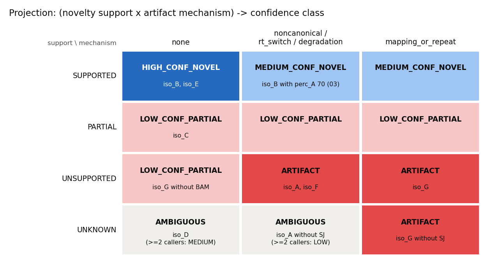

# 04. 지지 수준과 artifact 흔적을 어떻게 등급 하나로 합칠까?

[02](02_short_read_support.md)에서는 novel junction이 short read로 얼마나 확인됐는지(지지 수준), [03](03_artifact_mechanisms.md)에서는 어떤 artifact 흔적이 있는지(기전)를 정했다. 이 노트는 둘을 조합해서 confidence class 하나를 만드는 규칙을 본다. PanIsoGuard는 이 과정을 "2축 projection"이라고 부른다. 규칙은 12칸짜리 표 하나와, 표를 보기 전에 먼저 확인하는 몇 가지 예외로 되어 있다. 마지막에는 이 규칙 전체를 Python 40줄로 옮겨서, PanIsoGuard가 낸 판정과 하나하나 같은지 확인한다.

> 관련 문서: [docs/decision_engine.md](../docs/decision_engine.md) "Projection to confidence classes" · 코드: `RuleEngine::evaluate()`(`src/core/rules.cpp`), `src/core/analysis.cpp`(`ablate`)

## 1. 조합표는 어떻게 생겼을까?

지지 수준 네 가지와 기전 세 묶음을 곱하면 12칸이 된다. noncanonical, rt_switch, degradation은 같은 칸에 들어가니 한 묶음으로 그렸다. 칸 아래 작은 글씨는 이 시리즈에서 그 칸에 떨어진 예제다.



<details>
<summary>그림을 만든 코드</summary>

```python
import matplotlib
matplotlib.use("Agg")
import matplotlib.pyplot as plt

rows = ["SUPPORTED", "PARTIAL", "UNSUPPORTED", "UNKNOWN"]
cols = ["none", "noncanonical /\nrt_switch / degradation", "mapping_or_repeat"]
grid = {  # (row, col): (class, toy examples)
    (0, 0): ("HIGH_CONF_NOVEL", "iso_B, iso_E"),
    (0, 1): ("MEDIUM_CONF_NOVEL", "iso_B with perc_A 70 (03)"),
    (0, 2): ("MEDIUM_CONF_NOVEL", ""),
    (1, 0): ("LOW_CONF_PARTIAL", "iso_C"), (1, 1): ("LOW_CONF_PARTIAL", ""), (1, 2): ("LOW_CONF_PARTIAL", ""),
    (2, 0): ("LOW_CONF_PARTIAL", "iso_G without BAM"),
    (2, 1): ("ARTIFACT", "iso_A, iso_F"),
    (2, 2): ("ARTIFACT", "iso_G"),
    (3, 0): ("AMBIGUOUS", "iso_D\n(>=2 callers: MEDIUM)"),
    (3, 1): ("AMBIGUOUS", "iso_A without SJ\n(>=2 callers: LOW)"),
    (3, 2): ("ARTIFACT", "iso_G without SJ"),
}
# Ordinal diverging: confident novel (blue) <-> artifact (red), neutral gray for "no call".
FILL = {"HIGH_CONF_NOVEL": ("#256abf", "#ffffff"), "MEDIUM_CONF_NOVEL": ("#9ec5f4", "#0b0b0b"),
        "AMBIGUOUS": ("#f0efec", "#0b0b0b"), "LOW_CONF_PARTIAL": ("#f6c7c6", "#0b0b0b"),
        "ARTIFACT": ("#e34948", "#0b0b0b")}
fig, ax = plt.subplots(figsize=(8.4, 4.6), dpi=150)
for (r, c), (cls, ex) in grid.items():
    fill, ink = FILL[cls]
    ax.add_patch(plt.Rectangle((c, 3 - r), 0.97, 0.94, color=fill))
    ax.text(c + 0.485, 3 - r + 0.62, cls, ha="center", va="center", fontsize=9, color=ink, weight="bold")
    ax.text(c + 0.485, 3 - r + 0.3, ex, ha="center", va="center", fontsize=7.5, color=ink)
for r, name in enumerate(rows):
    ax.text(-0.05, 3 - r + 0.47, name, ha="right", va="center", fontsize=9, color="#0b0b0b")
for c, name in enumerate(cols):
    ax.text(c + 0.485, 4.05, name, ha="center", va="bottom", fontsize=9, color="#0b0b0b")
ax.text(-0.05, 4.05, "support \\ mechanism", ha="right", va="bottom", fontsize=8, color="#52514e")
ax.set_xlim(-0.95, 3.0); ax.set_ylim(-0.1, 4.55); ax.axis("off")
ax.set_title("Projection: (novelty support x artifact mechanism) -> confidence class", loc="left",
             fontsize=11, color="#0b0b0b")
fig.tight_layout()
fig.savefig("figures/04_projection_grid.png", dpi=150, facecolor="white")
print("cells:", len(grid))
```

```text
cells: 12
```

색은 믿을 만한 novel(파랑)에서 artifact(빨강)로 가는 순서를 나타내고, 판정을 보류한 `AMBIGUOUS`는 회색이다. 칸마다 등급 이름을 글자로 적어 두었으니 색을 구별하지 못해도 읽을 수 있다.

</details>

줄마다 읽으면 규칙이 단순하다.

- **`SUPPORTED`** 줄: 흔적이 없으면 `HIGH_CONF_NOVEL`, 흔적이 무엇이든 하나라도 있으면 `MEDIUM_CONF_NOVEL`이다. short read로 확인된 junction은 흔적이 있어도 `ARTIFACT`로 떨어뜨리지 않는다.
- **`PARTIAL`** 줄: 흔적과 상관없이 `LOW_CONF_PARTIAL`이다(0.0.4부터, [02](02_short_read_support.md) 4절).
- **`UNSUPPORTED`** 줄: 흔적이 없으면 `LOW_CONF_PARTIAL`, 흔적이 있으면 `ARTIFACT`다. short read를 봤는데 없었고, 가짜의 흔적까지 있을 때만 `ARTIFACT`가 된다.
- **`UNKNOWN`** 줄: short read로 볼 수 없었으니 원칙적으로 `AMBIGUOUS`다. 예외가 두 가지 있다(3절).

`HIGH_CONF_NOVEL`로 가는 길이 딱 한 칸뿐이라는 점을 눈여겨볼 만하다. short read가 novel junction을 전부 확인하고 흔적도 없어야 한다.

## 2. 조합표를 보기 전에 먼저 확인하는 것은?

`RuleEngine::evaluate()`는 조합표에 오기 전에 세 가지를 차례로 확인하고, 하나라도 해당되면 거기서 판정을 끝낸다.

1. **범주가 FSM이면** `HIGH_CONF_KNOWN`, **ISM이면** `LOW_CONF_PARTIAL`이다. 증거를 보지 않는다.
2. **NIC나 NNC가 아니면**(`genic`, `antisense`, `intergenic`, `fusion` 등) `AMBIGUOUS`다. PanIsoGuard가 판정하려고 만든 대상이 아니다.
3. **reference bias로 설명되면**(pangenome 축을 먼저, 그다음 variant 축) `PAN_REF_RESCUED_FALSE_NOVEL`이다. 출처가 불확실하면 `AMBIGUOUS`로 보류한다([05](05_reference_bias.md)).

3번이 조합표보다 앞에 있기 때문에 [00](00_overview.md)의 step4와 step5에서 `iso_A`의 `novelty_support`가 `UNKNOWN`으로 나왔다. rescue가 판정을 끝내 버려서 지지 수준을 정하는 단계까지 가지 않았고, 지지 수준 칸은 처음 값(`UNKNOWN`)으로 남았다. `SJ.out.tab`을 넣었는데도 그렇다.

## 3. `UNKNOWN` 줄의 예외 두 가지는 무엇일까?

첫째, **mapping 흔적은 short read 없이도 `ARTIFACT`를 만든다.** short read 표 없이 참조 GTF와 BAM만 넣고 돌려 본다.

```bash
PIG=../build/panisoguard; mkdir -p out
$PIG adjudicate --classification data/caller1_classification.txt --isoforms-gtf data/caller1.gtf \
  --ref-gtf data/reference.gtf --bam data/long_reads.bam --out-prefix out/nosj 2>/dev/null
cut -f1,5,6,7 out/nosj.adjudicated.tsv | column -t
```

```text
isoform_id  novelty_support  primary_mechanism  confidence_class
iso_A       UNKNOWN          noncanonical       AMBIGUOUS
iso_B       UNKNOWN          none               AMBIGUOUS
iso_C       UNKNOWN          none               AMBIGUOUS
iso_D       UNKNOWN          none               AMBIGUOUS
iso_E       UNKNOWN          none               AMBIGUOUS
iso_F       UNKNOWN          noncanonical       AMBIGUOUS
iso_G       UNKNOWN          mapping_or_repeat  ARTIFACT
iso_ism     UNKNOWN          none               LOW_CONF_PARTIAL
iso_known   SUPPORTED        none               HIGH_CONF_KNOWN
```

novel isoform이 모두 `UNKNOWN`인데 `iso_G`만 `ARTIFACT`다. 같은 `UNKNOWN`이라도 `iso_A`와 `iso_F`의 `noncanonical`은 `AMBIGUOUS`에 그친다. 두 흔적을 다르게 대하는 이유는 흔적이 어디서 왔는지에 있다. mapping 흔적은 이 isoform을 만든 long read의 정렬 자체를 직접 본 결과다. non-canonical motif는 참조 게놈의 서열일 뿐이라, [02](02_short_read_support.md)의 `iso_A`처럼 참조 게놈이 틀린 경우도 있다.

둘째, **caller 여러 개의 합의가 short read를 대신할 수 있다.** `--caller-support`로 caller별 결과를 합친 표를 주면, short read가 없을 때 caller 2개 이상이 같은 intron chain을 찾은 isoform은 흔적이 없으면 `MEDIUM_CONF_NOVEL`, 흔적이 있으면 `LOW_CONF_PARTIAL`이 된다. 합의로는 `HIGH`까지 올라가지 않는다. 같은 read로 돌린 caller들의 합의는 독립된 실험 증거가 아니기 때문이다. mapping 흔적이 있으면 합의가 있어도 `ARTIFACT`다. [06](06_multi_caller_consensus.md)에서 직접 돌려 본다.

## 4. 축 하나를 끄면 판정이 얼마나 바뀔까?

`EvidenceVector`만 있으면 판정을 다시 내릴 수 있으니, 증거 축 하나를 끄고 판정만 다시 돌려 보는 일이 싸다. `panisoguard ablate`가 그 일을 한다. [00](00_overview.md)의 step3 입력(참조 GTF + `SJ.out.tab` + BAM)으로 short read, mapping, noncanonical 축을 하나씩 꺼 봤다.

```bash
$PIG ablate --classification data/caller1_classification.txt --isoforms-gtf data/caller1.gtf \
  --ref-gtf data/reference.gtf --sj-tab data/short_reads.SJ.out.tab --bam data/long_reads.bam \
  --axes short_read,mapping,noncanonical --out out/abl 2>&1 | tail -5
cat out/abl.ablation_transitions.tsv
```

```text
ablation over 9 isoforms:
  short_read            5 / 9 changed (55.556%)
  mapping               1 / 9 changed (11.111%)
  noncanonical          2 / 9 changed (22.222%)
wrote out/abl.{ablation,ablation_transitions}.tsv
axis	transition	count
short_read	ARTIFACT->AMBIGUOUS	2
short_read	HIGH_CONF_NOVEL->AMBIGUOUS	2
short_read	LOW_CONF_PARTIAL->AMBIGUOUS	1
mapping	ARTIFACT->LOW_CONF_PARTIAL	1
noncanonical	ARTIFACT->LOW_CONF_PARTIAL	2
```

short read 축을 끄면 다섯 개가 바뀐다. `iso_A`와 `iso_F`의 `ARTIFACT`, `iso_B`와 `iso_E`의 `HIGH_CONF_NOVEL`, `iso_C`의 `LOW_CONF_PARTIAL`이 모두 `AMBIGUOUS`가 된다. `iso_G`는 3절의 첫째 예외 때문에 `ARTIFACT`로 남는다(연습문제 2). mapping 축을 끄면 `iso_G` 하나가, noncanonical 축을 끄면 `iso_A`와 `iso_F`가 `ARTIFACT`에서 `LOW_CONF_PARTIAL`로 올라간다. 이 예제에서는 short read 축이 판정을 가장 많이 좌우한다. `ablate`는 어느 축이 결과를 얼마나 움직이는지 보여 줄 뿐, 그 판정이 맞는지는 알려 주지 않는다. 맞는지는 정답이 있는 데이터로만 알 수 있다([07](07_evaluation.md)).

## 5. 규칙 전체를 Python으로 옮기면 판정이 똑같이 나올까?

지금까지의 규칙(2절의 예외, 1절의 조합표, 3절의 예외, [03](03_artifact_mechanisms.md)의 기전 순서)을 기본 기준값 그대로 Python으로 옮겼다. 입력은 `attribution.jsonl` 한 줄이다. `perc_A_downstream_TTS`는 JSON에 없어서 SQANTI3 분류표에서 가져온다. 이 시리즈에서 기본 설정으로 돌린 실행 열 개(9개 isoform × 9번 + `mini`의 1개)의 판정과 비교한다.

```python
import csv, json

NOVEL = ("novel_in_catalog", "novel_not_in_catalog")
MAP_GATES = {"bam_frac_low_mapq": 0.5, "bam_frac_supplementary": 0.5,
             "bam_frac_indel_near": 0.5, "bam_frac_softclip": 1.01}

def evaluate(cat, e, perc_a, min_callers=2):
    """RuleEngine::evaluate() with the built-in defaults, on one attribution.jsonl record."""
    if cat == "full-splice_match":
        return "HIGH_CONF_KNOWN"
    if cat == "incomplete-splice_match":
        return "LOW_CONF_PARTIAL"
    if cat not in NOVEL:
        return "AMBIGUOUS"
    for axis in ("pangenome", "variant"):                      # reference-bias rescue first
        if e[f"{axis}_evaluable"] and e[f"{axis}_rescue"]:
            return "AMBIGUOUS" if e[f"{axis}_circular"] else "PAN_REF_RESCUED_FALSE_NOVEL"
    n, k = e["n_novel_junctions"], e["n_novel_jx_sr_supported"]
    if not (e["sj_evaluable"] and e["chain_available"]) or n == 0:
        sup = "UNKNOWN"
    else:
        sup = "SUPPORTED" if k == n else "UNSUPPORTED" if k == 0 else "PARTIAL"
    if e["bam_evaluable"] and e["bam_n_spanning"] > 0 and any(e[f] > t for f, t in MAP_GATES.items()):
        mech = "mapping_or_repeat"
    elif e["noncanonical"]:
        mech = "noncanonical"
    elif e["rts_stage"]:
        mech = "rt_switch"
    elif perc_a is not None and perc_a >= 60:
        mech = "degradation"
    else:
        mech = "none"
    if sup == "UNKNOWN":
        if mech == "mapping_or_repeat":
            return "ARTIFACT"
        if e["consensus_evaluable"] and e["n_callers"] >= min_callers:
            return "MEDIUM_CONF_NOVEL" if mech == "none" else "LOW_CONF_PARTIAL"
        return "AMBIGUOUS"
    if sup == "SUPPORTED":
        return "HIGH_CONF_NOVEL" if mech == "none" else "MEDIUM_CONF_NOVEL"
    if sup == "PARTIAL":
        return "LOW_CONF_PARTIAL"
    return "LOW_CONF_PARTIAL" if mech == "none" else "ARTIFACT"

def check(runs):
    n_iso = n_same = 0
    for p in runs:
        meta = dict(l.rstrip("\n").split("\t", 1) for l in open(f"out/{p}.provenance.log") if "\t" in l)
        assert meta["config"] == "<built-in defaults>"      # this sketch knows only the default thresholds
        cls = {r["isoform"]: r for r in csv.DictReader(open(meta["classification"]), delimiter="\t")}
        for line in open(f"out/{p}.attribution.jsonl"):
            r = json.loads(line)
            pa = cls[r["isoform"]].get("perc_A_downstream_TTS", "NA")
            mine = evaluate(r["structural_category"], r["evidence"], None if pa in ("NA", "") else float(pa))
            n_iso += 1
            n_same += mine == r["confidence_class"]
            if mine != r["confidence_class"]:
                print("DIFF", p, r["isoform"], mine, r["confidence_class"])
    print(f"{len(runs)} runs, {n_iso} verdicts, {n_same} identical to PanIsoGuard")

check(["step0", "step1", "step2", "step3", "step4", "step5", "toy", "edited", "nosj", "mini"])
```

```text
10 runs, 82 verdicts, 82 identical to PanIsoGuard
```

82개가 모두 같다. `step0`–`step5`는 [00](00_overview.md) 1절, `toy`는 00 3절, `edited`와 `mini`는 [03](03_artifact_mechanisms.md), `nosj`는 이 노트 3절의 실행이다. [01](01_intron_chain_and_novelty.md) 4절에서 SQANTI-SIM 전체를 돌려 둔 `out/sqsim`에도 같은 함수를 써 봤다. 이 줄은 그 데이터가 있어야 돌아간다.

```python
check(["sqsim"])
```

```text
1 runs, 1579 verdicts, 1579 identical to PanIsoGuard
```

isoform 1,579개도 모두 같다. 판정 규칙 전체가 이 40줄 안에 있다는 뜻이다. PanIsoGuard의 C++ 코드 대부분은 파일을 읽고 좌표를 맞추고 증거를 모으는 일에 쓰이고, 판정 자체는 이만큼 작다. 판정을 따지고 싶을 때 이 함수 하나만 보면 된다는 점이 PanIsoGuard의 장점이다. 반대로 말하면, 판정이 틀렸다면 원인도 대개 이 40줄이 아니라 그 앞의 증거 쪽에 있다.

## 정리

- `SUPPORTED`는 흔적이 없으면 `HIGH`, 있으면 `MEDIUM`임. `PARTIAL`은 늘 `LOW_CONF_PARTIAL`임. `UNSUPPORTED`는 흔적이 없으면 `LOW_CONF_PARTIAL`, 있으면 `ARTIFACT`임. `UNKNOWN`은 원칙적으로 `AMBIGUOUS`임.
- 조합표보다 먼저 FSM/ISM의 통과, NIC/NNC가 아닌 범주의 `AMBIGUOUS`, reference-bias rescue를 확인함. rescue된 isoform은 지지 수준이 `UNKNOWN`으로 남음.
- `UNKNOWN` 줄의 예외는 둘임. mapping 흔적은 short read 없이도 `ARTIFACT`를 만들고, caller 2개 이상의 합의는 `MEDIUM`(흔적 있으면 `LOW`)까지 올림.
- `ablate`는 축 하나를 끄고 판정을 다시 내려서 각 축이 결과를 얼마나 움직이는지 보여 줌. 맞는지는 알려 주지 않음.
- 판정 규칙 전체를 Python 40줄로 옮겨 예제 82개와 SQANTI-SIM 1,579개의 판정을 모두 똑같이 재현함.

다음 노트 [05](05_reference_bias.md)에서는 조합표보다 먼저 보는 reference-bias rescue를 본다. `iso_A`가 `ARTIFACT`에서 `PAN_REF_RESCUED_FALSE_NOVEL`로 바뀌는 단계다.

## 연습문제

### 문제 1

> `UNSUPPORTED × none`은 `LOW_CONF_PARTIAL`인데, `UNKNOWN × noncanonical`은 `AMBIGUOUS`다. 둘 다 "확인이 안 됐다"는 점에서 비슷해 보이는데, 왜 다르게 대할까?

<details>
<summary>풀이</summary>

`UNSUPPORTED`는 short read를 봤는데 이 junction이 없었다는 **관찰**이다. 흔적은 없지만 확인도 안 됐으니 "믿기 어려운 쪽"인 `LOW_CONF_PARTIAL`에 둔다. `UNKNOWN`은 short read를 볼 수 없었다는 뜻이라 관찰 자체가 없다. 여기에 non-canonical motif 하나만으로 판정을 내리면, [02](02_short_read_support.md)의 `iso_A`처럼 참조 게놈 쪽이 틀린 경우에도 가짜로 몰게 된다. 그래서 보류(`AMBIGUOUS`)한다. 단, `UNKNOWN`이라도 mapping 흔적은 long read 정렬을 직접 본 것이라 예외로 `ARTIFACT`를 만든다(3절).

결과표를 필터로 쓸 때 이 차이가 중요하다. `AMBIGUOUS`는 "나쁘다"가 아니라 "모른다"이고, `LOW_CONF_PARTIAL`은 "확인하려 했지만 안 됐다"이다.

</details>

### 문제 2

> 4절의 `ablate`에서 short read 축을 끄자 `iso_A`와 `iso_F`의 `ARTIFACT`는 `AMBIGUOUS`로 바뀌었는데 `iso_G`의 `ARTIFACT`는 그대로였다. 왜일까?

<details>
<summary>풀이</summary>

short read 축을 끄면 세 isoform 모두 지지 수준이 `UNSUPPORTED`에서 `UNKNOWN`으로 바뀐다. 그다음은 기전에 달렸다. `iso_A`와 `iso_F`의 기전은 `noncanonical`이라 `UNKNOWN × noncanonical → AMBIGUOUS`다. `iso_G`의 기전은 `mapping_or_repeat`이고, 3절의 첫째 예외 때문에 `UNKNOWN × mapping_or_repeat → ARTIFACT`다. 3절의 실행(`out/nosj`, 처음부터 short read 표를 주지 않은 경우)과 같은 결과다. `ablate`가 파일을 다시 읽지 않고 증거에서 축 하나만 끈 뒤 판정을 다시 내리기 때문에 두 결과가 일치한다.

</details>

## 더 깊이 보기

<details>
<summary><code>ARTIFACT</code>를 필터로 쓸 때 주의할 점</summary>

[docs/decision_engine.md](../docs/decision_engine.md)는 `ARTIFACT`를 "(`UNSUPPORTED` × 흔적) 또는 (`UNKNOWN` × mapping)이라는 조합 신호이지, 가짜라는 단독 주장이 아니다"라고 적고 있다. 이 시리즈의 `iso_A`가 좋은 예다. step2와 step3에서 `ARTIFACT`였지만, 이 사람의 게놈 서열을 더하자 reference bias로 설명되었다([05](05_reference_bias.md)). `ARTIFACT`인 isoform을 결과에서 지우기 전에는 원래 read를 한 번 더 보는 것이 안전하다.

</details>

<details>
<summary>조합표를 TOML로 옮길 수 있을까</summary>

기준값(read 3개, 비율 0.5 등)은 TOML에서 바꿀 수 있지만, 이 노트의 조합표 자체는 C++ 코드(`RuleEngine::evaluate()`)에 들어 있다. [docs/decision_engine.md](../docs/decision_engine.md)의 "Future work"에 조합표를 TOML로 옮기는 계획이 적혀 있다. 조합표가 코드에 있으니 조합표를 바꿀 때는 기본 규칙 이름(`ruleset_version`)을 손으로 올려야 한다. 0.0.4의 `PARTIAL` 변경 때는 이것을 빠뜨려서, 0.0.3과 0.0.4가 같은 이름을 썼다([02](02_short_read_support.md) 6절).

</details>
