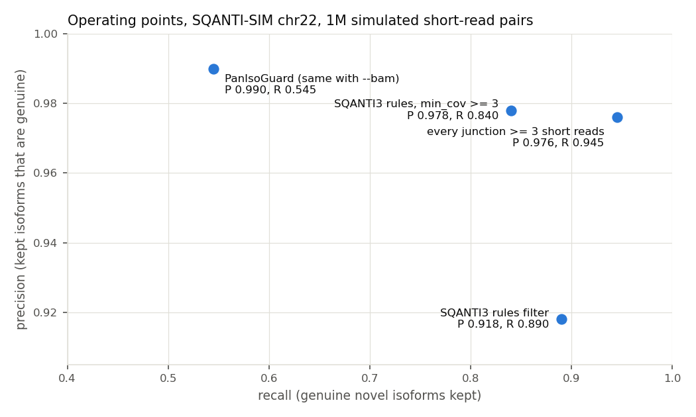

# 07. 이 판정이 맞는지는 어떻게 잴까?

지금까지는 PanIsoGuard가 **어떻게** 판정하는지를 봤다. 이 노트의 질문은 그 판정이 **맞는지**다. 맞는지 재려면 정답이 필요한데, 실제 데이터에는 어느 isoform이 진짜인지 알려 주는 정답이 없다. 그래서 정답을 알고 만든 시뮬레이션 데이터(SQANTI-SIM)를 쓴다. 이 노트에서는 정답을 만드는 방법, precision·recall·AUPRC를 계산하는 방법을 직접 따라가고, 저장소 README에 한때 적혀 있던 "AUPRC 0.970 vs 0.831 baseline"이라는 문장이 왜 오해를 부르는지도 따져 본다. 마지막으로 PanIsoGuard를 SQANTI3 필터, 그리고 한 줄짜리 규칙과 비교한 결과를 읽는다.

> 관련 문서: [benchmark/sqanti_sim](../benchmark/sqanti_sim), [benchmark/sqanti3_filter_h2h](../benchmark/sqanti3_filter_h2h), [docs/validation.md](../docs/validation.md) · 코드: `benchmark/sqanti_sim/score.py`, `benchmark/sqanti3_filter_h2h/score_h2h.py`

## 1. 정답은 어디서 올까?

SQANTI-SIM은 정답을 이렇게 만든다. 참조 주석(여기서는 GENCODE v49 chr22)에서 전사체를 골라 read를 시뮬레이션하고(PBSIM3, PacBio HiFi 흉내), 그중 일부 전사체를 **주석에서 지운다.** caller(FLAIR)와 SQANTI3에는 지운 주석을 준다. 그러면 지운 전사체는 caller 입장에서 "주석에 없는 새 isoform"이 되고, 우리는 그것이 진짜라는 것을 안다.

정답 라벨은 intron chain이 정확히 같은지로 붙인다(`score.py`).

| 라벨 | 조건 |
|---|---|
| `genuine_novel` | caller isoform의 intron chain이 **지운** 전사체의 chain과 같음 |
| `known` | 지우지 않고 남긴 전사체의 chain과 같음 |
| `false_novel` | intron이 있는데, 시뮬레이션한 어느 전사체의 chain과도 같지 않음 (caller나 정렬이 만든 가짜) |
| `monoexonic` | intron이 없음 (평가에서 뺌) |

[01](01_intron_chain_and_novelty.md) 4절에서 돌려 둔 `out/sqsim`(PanIsoGuard 0.0.4로 SQANTI-SIM chr22를 판정한 결과)을 이 라벨로 채점했다. 이 블록은 [benchmark/sqanti_sim/run.sh](../benchmark/sqanti_sim/run.sh)의 작업 폴더가 있어야 돌아간다.

```bash
W=/mnt/Data/pig_sqantisim/work
python3 ../benchmark/sqanti_sim/score.py $W/flair.isoforms.gtf $W/truth.truth.tsv out/sqsim.adjudicated.tsv
```

```text
=== confusion (truth rows x PanIsoGuard class) ===
truth          HIGH_CONF HIGH_CONF MEDIUM_CO LOW_CONF_ AMBIGUOUS  ARTIFACT   total
genuine_novel          0       385        45       154       146         0     730
known                652         0         0         0         0         0     652
false_novel            8         4         1        61         6        68     148
monoexonic            33         0         0         9         7         0      49

=== genuine-novel detection (predicted genuine = HIGH/MEDIUM_CONF_NOVEL) ===
genuine_novel=730  false_novel=148
precision=0.989  recall=0.589  specificity(false rejected)=0.966

=== genuine-novel recall by SQANTI category ===
  incomplete-splice_match      0/154  recall=0.000
  novel_in_catalog             133/279  recall=0.477
  novel_not_in_catalog         297/297  recall=1.000

=== AUPRC (genuine-novel vs false, n=878, positives=730) ===
AUPRC = 0.9712   (baseline = 0.8314)
```

표의 열 이름이 9글자에서 잘려서 첫 두 열이 모두 `HIGH_CONF`로 보이는데, 첫 열은 `HIGH_CONF_KNOWN`, 둘째 열은 `HIGH_CONF_NOVEL`이다.

## 2. precision, recall, specificity는 무엇을 셀까?

`HIGH_CONF_NOVEL`이나 `MEDIUM_CONF_NOVEL`이면 "진짜라고 불렀다"로 보고 센다.

- **precision** = 진짜라고 부른 것 중 실제로 진짜인 비율 = (385 + 45) / (385 + 45 + 4 + 1) = 430 / 435 = **0.989**
- **recall** = 실제 진짜 중 진짜라고 부른 비율 = 430 / 730 = **0.589**
- **specificity** = 실제 가짜 중 진짜라고 부르지 않은 비율 = (148 − 5) / 148 = **0.966**

precision은 아주 높고 recall은 60%가 안 된다. 진짜를 놓친 300개는 어디 있을까? 표의 첫 줄을 보면 `LOW_CONF_PARTIAL` 154개와 `AMBIGUOUS` 146개다. 범주별 recall을 보면 그 정체가 나온다. NNC는 297개를 모두 찾았다. NIC는 절반을 못 찾았는데, [01](01_intron_chain_and_novelty.md) 4절에서 본 대로 대부분 알려진 junction의 조합이라 확인할 novel junction이 없어서 `AMBIGUOUS`로 보류된 것이다. ISM 154개는 전부 놓쳤다. SQANTI-SIM이 지운 전사체 중에는 남은 전사체의 일부처럼 보이는 것이 있어서, SQANTI3가 ISM으로 분류하고 PanIsoGuard는 ISM을 늘 `LOW_CONF_PARTIAL`로 둔다([04](04_projection.md) 2절). 이 154개도 chain이 지운 전사체와 정확히 같으니 진짜다. 판정을 내리지 않은 것이지 틀리게 내린 것은 아니지만, 놓친 것은 놓친 것이다.

## 3. AUPRC와 "baseline"은 무엇일까?

precision과 recall은 "어디서부터 진짜라고 부를지"라는 선 하나에 달렸다. AUPRC는 그 선을 가장 믿을 만한 쪽부터 한 칸씩 내리면서 precision과 recall을 모두 계산하고, 그 곡선 아래 넓이를 잰 값이다. 순위를 얼마나 잘 매겼는지를 숫자 하나로 요약한다.

PanIsoGuard의 등급은 순서가 있는 이름이라 숫자로 바꿔야 한다. `score.py`는 `HIGH_CONF_NOVEL` 1.0, `MEDIUM_CONF_NOVEL` 0.75, `AMBIGUOUS` 0.5, `LOW_CONF_PARTIAL` 0.25, `HIGH_CONF_KNOWN` 0.1, `ARTIFACT` 0으로 바꾼다. 위 혼동표의 숫자만 있으면 AUPRC를 다시 계산할 수 있다. 데이터 없이 돌아간다.

```python
from sklearn.metrics import average_precision_score

# class -> (genuine_novel, false_novel), read off the confusion table above
counts = {"HIGH_CONF_NOVEL": (385, 4), "MEDIUM_CONF_NOVEL": (45, 1), "AMBIGUOUS": (146, 6),
          "LOW_CONF_PARTIAL": (154, 61), "HIGH_CONF_KNOWN": (0, 8), "ARTIFACT": (0, 68)}
SCORE = {"HIGH_CONF_NOVEL": 1.0, "MEDIUM_CONF_NOVEL": 0.75, "AMBIGUOUS": 0.5,      # score.py's ranking
         "LOW_CONF_PARTIAL": 0.25, "HIGH_CONF_KNOWN": 0.1, "ARTIFACT": 0.0}

def auprc(score):
    y, s = [], []
    for cls, (g, f) in counts.items():
        y += [1] * g + [0] * f
        s += [score[cls]] * (g + f)
    return average_precision_score(y, s)

pos, n = sum(g for g, _ in counts.values()), sum(g + f for g, f in counts.values())
print(f"AUPRC {auprc(SCORE):.4f} | positive rate {pos}/{n} = {pos / n:.4f}")
print(f"every isoform gets the same score: AUPRC {auprc({c: 0 for c in SCORE}):.4f}")
print(f"AMBIGUOUS ranked below LOW_CONF_PARTIAL: AUPRC {auprc(dict(SCORE, AMBIGUOUS=0.25, LOW_CONF_PARTIAL=0.5)):.4f}")

print("\ncall 'genuine' from the top class down to ... :")
tp = fp = 0
for cls in sorted(SCORE, key=SCORE.get, reverse=True):
    g, f = counts[cls]
    tp, fp = tp + g, fp + f
    print(f"  {cls:18s} precision {tp / (tp + fp):.3f}  recall {tp / pos:.3f}")
```

```text
AUPRC 0.9712 | positive rate 730/878 = 0.8314
every isoform gets the same score: AUPRC 0.8314
AMBIGUOUS ranked below LOW_CONF_PARTIAL: AUPRC 0.9545

call 'genuine' from the top class down to ... :
  HIGH_CONF_NOVEL    precision 0.990  recall 0.527
  MEDIUM_CONF_NOVEL  precision 0.989  recall 0.589
  AMBIGUOUS          precision 0.981  recall 0.789
  LOW_CONF_PARTIAL   precision 0.910  recall 1.000
  HIGH_CONF_KNOWN    precision 0.901  recall 1.000
  ARTIFACT           precision 0.831  recall 1.000
```

첫 줄의 AUPRC 0.9712가 `score.py`의 값과 같다. 둘째 줄이 이 절의 핵심이다. **모든 isoform에 같은 점수를 주면, 곧 아무 정보 없이 순서를 매기면 AUPRC는 양성 비율(0.8314)이 된다.** `score.py`가 "baseline"이라고 찍어 주는 0.8314가 바로 이 값이다. 경쟁하는 다른 방법의 점수가 아니다.

README에는 한동안 "AUPRC 0.970 vs a 0.831 baseline"이라고 적혀 있었다. 이렇게 쓰면 기존 방법보다 크게 나은 것처럼 읽히지만, 실제로는 "무작위보다 낫다"는 뜻이다. 이 데이터는 novel isoform의 83%가 진짜라서, 무작위 순위도 0.83을 받는다. 무작위와 완벽(1.0) 사이 거리의 몇 %를 줄였는지로 보는 편이 덜 헷갈린다(연습문제 1). 비교는 다른 방법과 해야 한다. 4절에서 한다.

셋째 줄은 AUPRC가 등급을 숫자로 바꾸는 방식에 달렸다는 것을 보여 준다. `AMBIGUOUS`와 `LOW_CONF_PARTIAL`의 순서만 바꿔도 0.9712가 0.9545가 된다. 등급은 순서만 있는 이름이라 이 숫자 변환은 평가하는 쪽이 정하는 것이고, 그에 따라 결과가 달라진다(연습문제 2).

아래쪽 목록은 선을 한 칸씩 내린 결과다. `MEDIUM_CONF_NOVEL`까지 진짜로 부르면 precision 0.989, recall 0.589(2절의 숫자)이고, `AMBIGUOUS`까지 부르면 precision 0.981, recall 0.789가 된다. 보류한 isoform 대부분이 사실 진짜라서 생기는 일이다. 결과표를 필터로 쓸 때 어느 등급까지 남길지는 이렇게 precision과 recall을 맞바꾸는 선택이다.

## 4. 다른 방법과 비교하면 어떨까?

비교 대상은 셋이다. SQANTI3의 기본 rules filter, `min_cov ≥ 3`을 필수로 바꾼 rules filter, 그리고 "isoform의 **모든** junction에 short read가 3개 이상이면 진짜"라는 한 줄짜리 규칙이다. short read는 세 가지로 줬다. 없음, 정답에서 만든 완벽한 표(oracle, [02](02_short_read_support.md) "더 깊이 보기"), 그리고 short read 100만 쌍을 시뮬레이션해서 STAR로 정렬한 현실적인 표다. 대상은 FSM을 뺀 novel 후보 870개(진짜 730, 가짜 140)다. 전체 실행은 [benchmark/sqanti3_filter_h2h/run.sh](../benchmark/sqanti3_filter_h2h/run.sh)에 있고, 결과는 저장소에 들어 있어서 바로 읽을 수 있다.

```python
import json
env = json.load(open("../benchmark/results/sqanti3_filter_h2h/metrics.json"))
m = env["metrics"]
for setting in ("none", "sr_1000000", "oracle"):
    print(f"short reads: {setting}")
    for method in ("SQ3rules", "allSJ3", "PIG", "PIG+bam"):
        r = m[setting].get(method)
        if r:
            prec = "  -  " if r["prec"] is None else f"{r['prec']:.3f}"
            print(f"  {method:9s} TP {r['TP']:3d} FP {r['FP']:3d} precision {prec} recall {r['rec']:.3f} AUPRC {r['auprc']:.3f}")
print("bootstrap 95% CI of AUPRC(PanIsoGuard) - AUPRC(allSJ3):")
for setting, ci in m["bootstrap_auprc_diff_vs_allSJ3_95ci"].items():
    print(f"  {setting:10s} PIG {ci['PIG']}  PIG+bam {ci['PIG+bam']}")
print("no short reads, vs SQ3rules:", m["bootstrap_auprc_diff_vs_SQ3rules_95ci_no_short_reads"])
```

```text
short reads: none
  SQ3rules  TP 647 FP  58 precision 0.918 recall 0.886 AUPRC 0.909
  PIG       TP   0 FP   0 precision   -   recall 0.000 AUPRC 0.824
  PIG+bam   TP   0 FP   0 precision   -   recall 0.000 AUPRC 0.875
short reads: sr_1000000
  SQ3rules  TP 650 FP  58 precision 0.918 recall 0.890 AUPRC 0.909
  allSJ3    TP 690 FP  17 precision 0.976 recall 0.945 AUPRC 0.968
  PIG       TP 398 FP   4 precision 0.990 recall 0.545 AUPRC 0.968
  PIG+bam   TP 398 FP   4 precision 0.990 recall 0.545 AUPRC 0.977
short reads: oracle
  SQ3rules  TP 652 FP  58 precision 0.918 recall 0.893 AUPRC 0.910
  allSJ3    TP 730 FP  18 precision 0.976 recall 1.000 AUPRC 0.976
  PIG       TP 430 FP   5 precision 0.989 recall 0.589 AUPRC 0.971
  PIG+bam   TP 430 FP   5 precision 0.989 recall 0.589 AUPRC 0.979
bootstrap 95% CI of AUPRC(PanIsoGuard) - AUPRC(allSJ3):
  oracle     PIG [-0.015, 0.005]  PIG+bam [-0.007, 0.012]
  sr_1000000 PIG [-0.011, 0.01]  PIG+bam [-0.001, 0.018]
  sr_250000  PIG [-0.008, 0.013]  PIG+bam [0.002, 0.021]
  sr_4000000 PIG [-0.011, 0.01]  PIG+bam [-0.002, 0.018]
no short reads, vs SQ3rules: {'PIG': [-0.106, -0.066], 'PIG+bam': [-0.06, -0.008]}
```

`allSJ3`가 한 줄 규칙이고 `PIG`가 PanIsoGuard다. 읽을 곳은 세 군데다.

1. **순위(AUPRC)**: short read 100만 쌍일 때 PanIsoGuard와 한 줄 규칙은 둘 다 0.968이다. 차이의 bootstrap 95% 신뢰구간(isoform을 복원 추출로 2,000번 다시 뽑아 매번 차이를 계산한 범위)이 모든 깊이에서 0을 포함한다. 통계적으로 구분되지 않는다는 뜻이다. BAM을 더하면 +0.01 정도 오르는데, 신뢰구간이 0을 넘는 것은 25만 쌍일 때뿐이다.
2. **기본 선(precision, recall)**: PanIsoGuard는 가장 정확하지만(0.990) 절반쯤만 찾는다(0.545). 한 줄 규칙은 조금 덜 정확하지만(0.976) 거의 다 찾는다(0.945). 차이는 2절에서 본 NIC와 ISM의 보류에서 온다.
3. **short read가 없을 때**: PanIsoGuard는 진짜라고 부르는 것이 하나도 없고(모두 `AMBIGUOUS`), 순위도 SQANTI3 rules filter보다 신뢰구간이 0 아래로 떨어질 만큼 나쁘다.



<details>
<summary>그림을 만든 코드</summary>

```python
import json
import matplotlib
matplotlib.use("Agg")
import matplotlib.pyplot as plt

m = json.load(open("../benchmark/results/sqanti3_filter_h2h/metrics.json"))["metrics"]["sr_1000000"]
label = {"SQ3rules": "SQANTI3 rules filter", "SQ3strict": "SQANTI3 rules, min_cov >= 3",
         "allSJ3": "every junction >= 3 short reads", "PIG": "PanIsoGuard (same with --bam)"}
INK, MUTED, GRID, DOT = "#0b0b0b", "#52514e", "#e1e0d9", "#2a78d6"
fig, ax = plt.subplots(figsize=(7, 4.2), dpi=150)
# label placement per point: (dx, dy) in points, horizontal and vertical alignment
PLACE = {"PIG": (8, -4, "left", "top"), "SQ3strict": (-9, 0, "right", "center"),
         "allSJ3": (-9, -7, "right", "top"), "SQ3rules": (-9, 0, "right", "center")}
for key, text in label.items():
    r = m[key]
    dx, dy, ha, va = PLACE[key]
    ax.scatter(r["rec"], r["prec"], s=46, color=DOT, zorder=3)
    ax.annotate(f"{text}\nP {r['prec']:.3f}, R {r['rec']:.3f}", (r["rec"], r["prec"]), xytext=(dx, dy),
                textcoords="offset points", fontsize=8, color=INK, ha=ha, va=va)
ax.set_xlim(0.4, 1.0); ax.set_ylim(0.905, 1.0)
ax.set_xlabel("recall (genuine novel isoforms kept)", color=MUTED, fontsize=9)
ax.set_ylabel("precision (kept isoforms that are genuine)", color=MUTED, fontsize=9)
ax.grid(color=GRID, lw=0.6); ax.set_axisbelow(True)
ax.tick_params(colors=MUTED, labelsize=8)
for s in ("top", "right"):
    ax.spines[s].set_visible(False)
for s in ("left", "bottom"):
    ax.spines[s].set_color(GRID)
ax.set_title("Operating points, SQANTI-SIM chr22, 1M simulated short-read pairs", loc="left", fontsize=10, color=INK)
fig.tight_layout()
fig.savefig("figures/07_operating_points.png", dpi=150, facecolor="white")
print({k: (m[k]["prec"], m[k]["rec"]) for k in label})
```

```text
{'SQ3rules': (0.918, 0.89), 'SQ3strict': (0.978, 0.84), 'allSJ3': (0.976, 0.945), 'PIG': (0.99, 0.545)}
```

세로축은 0.905에서 시작한다. 점의 위치를 비교하려는 그림이라 0부터 그리면 네 점이 한 줄에 붙어 보이기 때문이다.

</details>

그림에서 PanIsoGuard는 왼쪽 위, 한 줄 규칙은 오른쪽 위에 있다. 오른쪽 위로 갈수록 좋으니, 이 데이터에서는 한 줄 규칙이 PanIsoGuard의 점을 거의 지배한다. precision 0.014를 얻으려고 recall 0.4를 내준 셈이다.

그래서 이 저장소는 PanIsoGuard를 "더 정확한 필터"로 소개하지 않는다([README](../README.md) "How it compares"). PanIsoGuard가 더하는 것은 판정마다 이유(`rule_trace`)와 기전이 남는다는 점, 증거가 없으면 억지로 판정하지 않는다는 점이다. 필터된 GTF만 필요하다면 한 줄 규칙이나 SQANTI3 필터가 더 단순하고 recall도 높다.

## 5. 이 숫자들을 읽을 때 무엇을 조심할까?

- **시뮬레이션 하나다.** chr22, PacBio HiFi 흉내, FLAIR 하나로 만든 데이터다. 실제 데이터의 가짜는 다른 모양일 수 있다. [03](03_artifact_mechanisms.md)에서 본 것처럼 이 시뮬레이션은 intra-priming을 흉내 내지 않고, 시뮬레이션한 short read도 intron retention이나 pre-mRNA read 없이 깨끗하다. 실제 데이터에서는 한 줄 규칙이 이만큼 좋지 않을 수 있다.
- **기준값은 이 데이터에서 골랐다.** PanIsoGuard의 기준값을 SQANTI-SIM에서 바꿔 가며 확인했으니([02](02_short_read_support.md) 6절), 같은 데이터로 잰 PanIsoGuard의 성능은 약간 후하게 나올 수 있다. 다른 데이터로 기준값을 다시 확인하지는 않았다.
- **reference-bias rescue는 이 평가에 들어 있지 않다.** SQANTI-SIM에는 개인 haplotype이 없다. 그 기능의 벤치마크는 정답 라벨이 규칙과 같은 조건이라 구현 확인에 그친다([05](05_reference_bias.md) 6절).
- **0.0.4에서 규칙을 하나 바꿨다.** `PARTIAL`을 `MEDIUM`에서 `LOW`로 내린 것은 이 비교에서 틀린 사례를 보고 바꾼 것이다([02](02_short_read_support.md) 4절). 같은 데이터로 고치고 같은 데이터로 잰 숫자라는 점도 기억해 둬야 한다. 다만 이 변경으로 바뀐 판정은 가짜 3개뿐이고 recall은 그대로라, 결론(한 줄 규칙과 구분되지 않음)은 바뀌지 않는다.

## 정리

- 정답은 SQANTI-SIM이 주석에서 지운 전사체임. caller isoform의 intron chain이 지운 전사체와 같으면 진짜, 어느 시뮬레이션 전사체와도 다르면 가짜임.
- PanIsoGuard 0.0.4는 SQANTI-SIM chr22에서 precision 0.989, recall 0.589, specificity 0.966, AUPRC 0.971임. 놓친 진짜 300개는 NIC와 ISM의 보류와 `LOW_CONF_PARTIAL`에 있음.
- "baseline 0.831"은 양성 비율, 곧 무작위 순위의 AUPRC임. 다른 방법의 점수가 아님. AUPRC는 등급을 숫자로 바꾸는 방식에 따라서도 달라짐(0.971 ↔ 0.955).
- 한 줄 규칙("모든 junction에 short read 3개 이상")과 비교하면 순위(AUPRC)는 통계적으로 구분되지 않고, 기본 선에서는 precision이 0.014 높은 대신 recall이 0.4 낮음. short read가 없으면 SQANTI3 rules filter보다 나쁨.
- 그래서 PanIsoGuard의 쓸모는 정확도보다 판정마다 남는 이유와 기전에 있음.

다음 노트 [08](08_one_isoform_end_to_end.md)에서는 시리즈를 마무리하며 `iso_A` 하나를 입력 파일에서 최종 등급까지 PanIsoGuard 없이 손으로 끝까지 계산해 본다.

## 연습문제

### 문제 1

> AUPRC 0.971은 baseline 0.831보다 0.14 높다. 이것은 얼마나 좋은 것일까?

<details>
<summary>풀이</summary>

AUPRC는 무작위 순위일 때 양성 비율(0.831), 완벽한 순위일 때 1이다. 그 사이 거리의 얼마를 줄였는지로 보면 비교하기 쉽다.

```python
prev = 730 / 878
for name, ap in (("PanIsoGuard", 0.9712), ("AMBIGUOUS below LOW", 0.9545)):
    print(f"{name:20s} AUPRC {ap:.4f} -> share of the gap from random ({prev:.4f}) to perfect (1) closed: {(ap - prev) / (1 - prev):.2f}")
```

```text
PanIsoGuard          AUPRC 0.9712 -> share of the gap from random (0.8314) to perfect (1) closed: 0.83
AMBIGUOUS below LOW  AUPRC 0.9545 -> share of the gap from random (0.8314) to perfect (1) closed: 0.73
```

무작위와 완벽 사이의 83%를 줄였다. 나쁘지 않은 순위다. 하지만 이것만으로는 다른 방법보다 나은지 알 수 없다. 4절의 한 줄 규칙도 같은 데이터에서 0.976이었다. 양성 비율이 높은 데이터에서는 AUPRC가 모두 1 근처에 몰리니, 숫자 하나보다 같은 데이터에서 다른 방법과 나란히 비교한 값을 봐야 한다.

</details>

### 문제 2

> `score.py`는 `AMBIGUOUS`(0.5)를 `LOW_CONF_PARTIAL`(0.25)보다 위에 둔다. 판정을 보류한 것을 "일부만 확인됐다"보다 위에 두는 것이 이상해 보인다. 어느 쪽이 맞을까?

<details>
<summary>풀이</summary>

정해진 답은 없다. 등급은 순서만 있는 이름이고, 이 두 등급은 서로 다른 이유로 만들어져서 어느 쪽이 더 믿을 만한지는 데이터에 달렸다. SQANTI-SIM에서는 이렇다.

```python
counts = {"AMBIGUOUS": (146, 6), "LOW_CONF_PARTIAL": (154, 61)}
for c, (g, f) in counts.items():
    print(f"{c:16s} genuine {g}/{g + f} = {g / (g + f):.2f}")
```

```text
AMBIGUOUS        genuine 146/152 = 0.96
LOW_CONF_PARTIAL genuine 154/215 = 0.72
```

이 데이터에서는 `AMBIGUOUS`가 훨씬 더 진짜가 많다. `AMBIGUOUS`의 대부분이 알려진 junction만 조합한 NIC라서, 새 junction을 만들어 내는 가짜가 끼어들 틈이 적기 때문이다. 반면 `LOW_CONF_PARTIAL`에는 ISM(진짜 154개)과 확인 안 된 NNC 가짜(61개)가 섞여 있다. 그러니 `score.py`의 순서가 이 데이터에는 맞는 셈이다. 하지만 이 순서는 판정 규칙이 정한 것이 아니라 평가하는 쪽이 정한 것이고, 순서를 바꾸면 AUPRC가 0.017 떨어진다. 다른 도구와 AUPRC를 비교할 때는 이런 변환이 어떻게 정해졌는지까지 같이 적어야 한다.

</details>

## 더 깊이 보기

<details>
<summary>score.py의 AUPRC와 h2h의 AUPRC는 왜 조금 다른가</summary>

1절의 `score.py`는 정답이 `genuine_novel`이나 `false_novel`인 isoform **878개**를 모두 쓴다. 여기에는 SQANTI3가 FSM으로 분류했는데 정답은 가짜인 8개가 들어 있다(혼동표의 `false_novel` × `HIGH_CONF_KNOWN`). 4절의 h2h 비교는 FSM을 빼고 novel 후보 **870개**만 쓴다. FSM은 PanIsoGuard가 판정하지 않고 통과시키는 범주라, 비교에서 빼는 편이 공정하기 때문이다. 그래서 같은 oracle 입력인데도 `score.py`는 0.9712, h2h는 0.971(반올림)로 거의 같지만 계산 대상은 다르다. precision도 두 스크립트 모두 0.989지만, 가짜 5개(`HIGH` 4 + `MEDIUM` 1)가 어느 범주에서 나왔는지까지 따지면 h2h 쪽 집합이 8개 작다.

</details>
